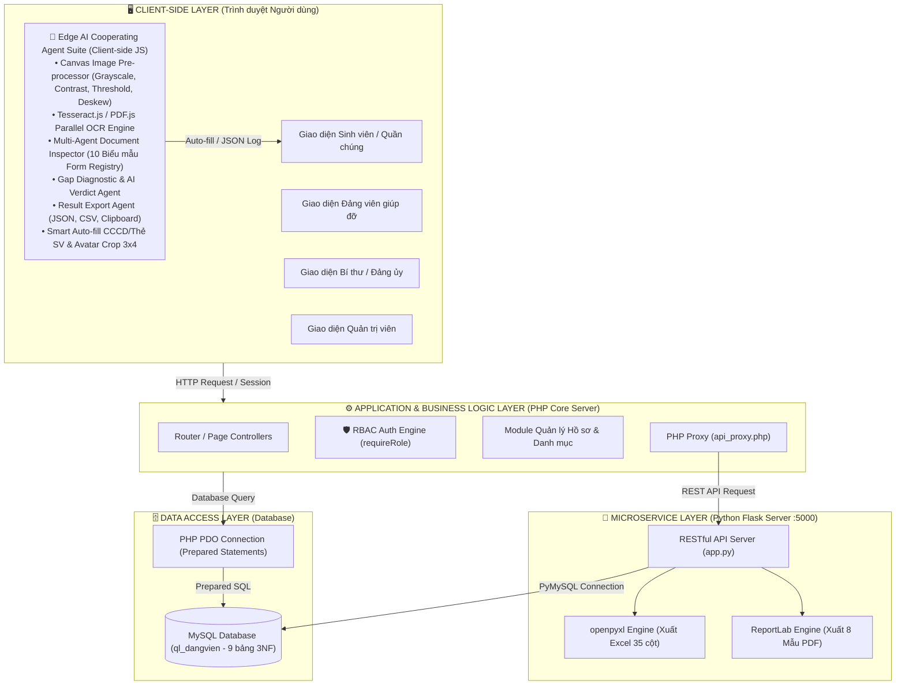
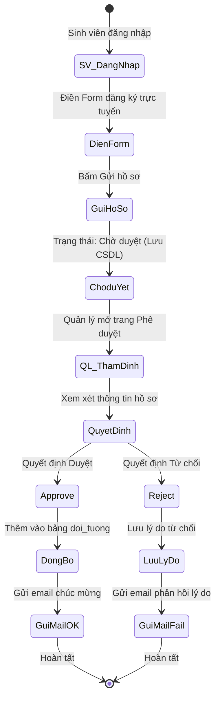
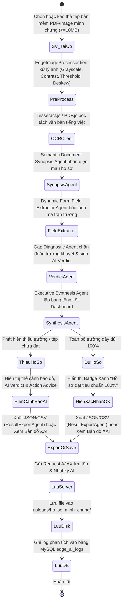
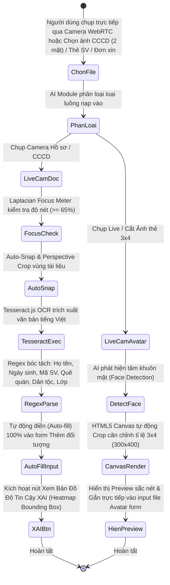
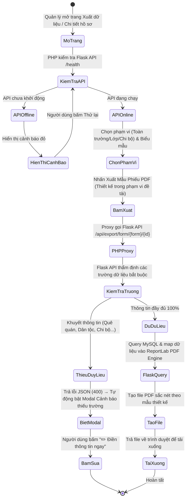
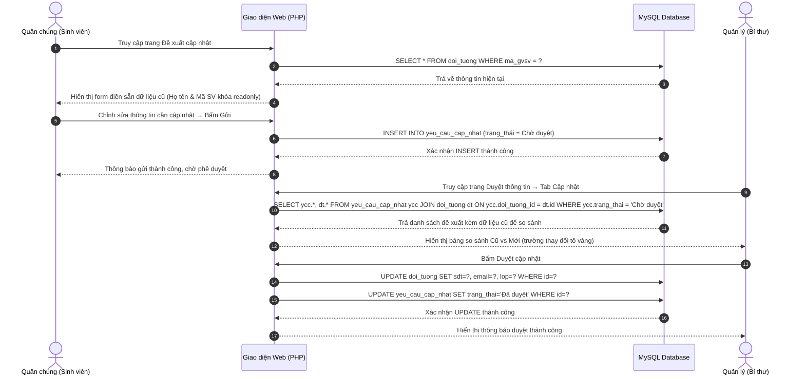
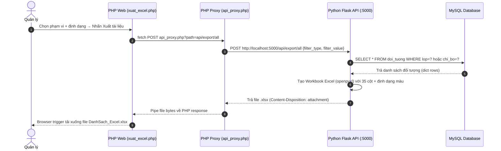
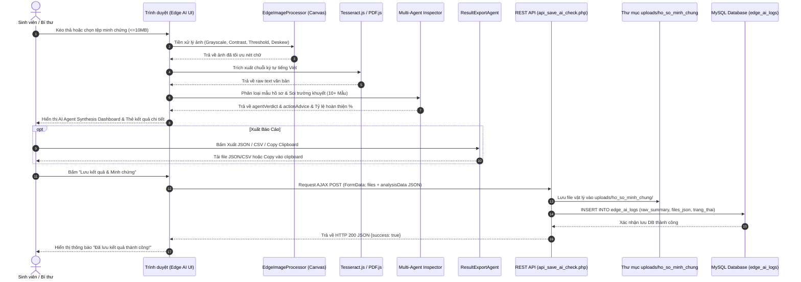
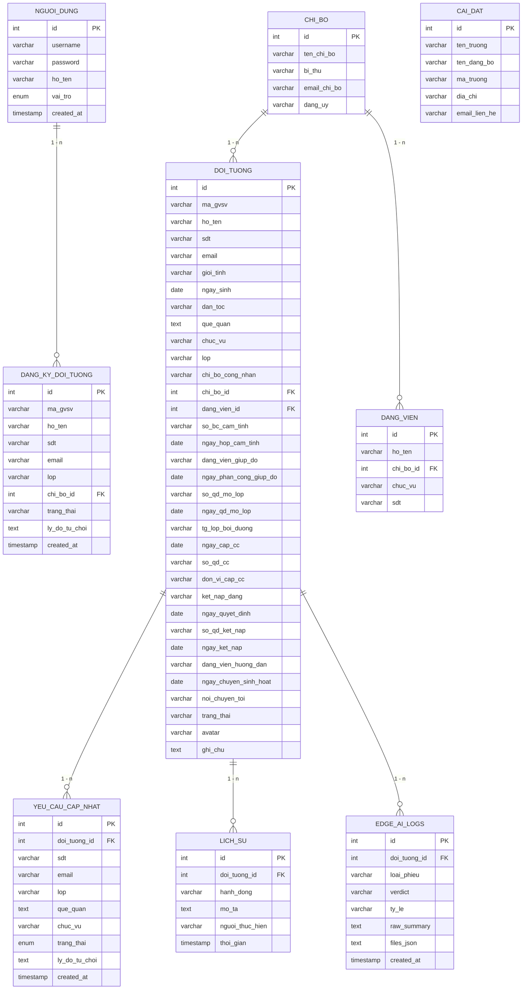

```mermaid
flowchart TD
    User["👤 Người dùng thường (Sinh viên)"]
    Manager["💼 Quản lý (Bí thư)"]
    Admin["⚙️ Quản trị viên (Admin)"]

    subgraph SG_User["Chức năng Sinh viên"]
        UC_Login["Đăng nhập / Đăng ký"]
        UC_Dash["Xem Dashboard cá nhân"]
        UC_Timeline["Xem tiến trình 5 bước"]
        UC_Reg["Gửi hồ sơ đăng ký mới"]
        UC_Update["Gửi đề xuất cập nhật"]
        UC_Class["Xem bạn cùng Lớp/Chi bộ"]
        UC_News["Xem tin tức 3 nguồn báo"]
    end

    subgraph SG_Manager["Chức năng Quản lý (Bí thư)"]
        UC_List["Danh sách đối tượng"]
        UC_CRUD["Thêm / Sửa / Xóa hồ sơ"]
        UC_ExcelEdit["Sửa nhanh dạng Excel"]
        UC_ApproveReg["Phê duyệt đơn đăng ký"]
        UC_ApproveUpd["Phê duyệt cập nhật"]
        UC_Import["Import Excel/CSV"]
        UC_Export["Xuất Excel/PDF qua Flask API"]
        UC_Stats["Thống kê biểu đồ Chart.js"]
        UC_Search["Tìm kiếm nâng cao"]
        UC_DM["Quản lý Chi bộ & Đảng viên"]
    end

    subgraph SG_Admin["Chức năng riêng Admin"]
        UC_Users["Quản lý tài khoản"]
        UC_Config["Cài đặt hệ thống"]
    end

    User --> UC_Login
    User --> UC_Dash
    User --> UC_Timeline
    User --> UC_Reg
    User --> UC_Update
    User --> UC_Class
    User --> UC_News

    Manager --> UC_Login
    Manager --> UC_List
    Manager --> UC_CRUD
    Manager --> UC_ExcelEdit
    Manager --> UC_ApproveReg
    Manager --> UC_ApproveUpd
    Manager --> UC_Import
    Manager --> UC_Export
    Manager --> UC_Stats
    Manager --> UC_Search
    Manager --> UC_DM
    Manager --> UC_News

    Admin --> UC_Users
    Admin --> UC_Config
    Admin --> SG_Manager
```

# BÁO CÁO PROJECT

## QUẢN LÝ QUẦN CHÚNG ƯU TÚ PHỤC VỤ KẾT NẠP ĐẢNG

---

- **Môn học:** Thiết kế Website / Phát triển Ứng dụng Web / Phân tích Thiết kế Hệ thống
- **Đề tài:** Thiết kế Website quản lý quần chúng ưu tú phục vụ kết nạp Đảng
- **Công nghệ:** PHP 8.x + Python Flask + MySQL (XAMPP)
- **Repository:** https://github.com/Datdajt03/QLQTUT-Dang
- **Nhóm thực hiện:** [02]
- **Thành viên:**
  1. LÒ MẠNH ĐẠT – 2023A0861 – Phân công: Backend PHP, Database, Agent AI, Báo cáo
  2. NGUYỄN HUY HOÀNG – 2023A0875 – Phân công: Frontend Python API, Edge AI
  3. TÒNG LƯU ANH TÚ – 2023A0937 – Phân công: Báo cáo CSS/JS, UI/UX, Edge AI
  4. PHẠM THỊ THANH HẢO – 2023A0869 – Phân công: Python API, Báo cáo

---

## I. GIỚI THIỆU ĐỀ TÀI

### 1. Lý do chọn đề tài

Công tác phát triển Đảng viên mới là nhiệm vụ chính trị quan trọng trong các tổ chức Đảng, đặc biệt tại các trường Đại học nhằm bồi dưỡng thế hệ trẻ ưu tú. Hiện nay, quy trình quản lý thông tin từ giai đoạn quần chúng ưu tú, đi học lớp cảm tình Đảng, hoàn thành nhận thức, đến khi ra quyết định kết nạp và làm lễ kết nạp trải qua nhiều bước và thủ tục thủ công, dễ gây thất lạc hồ sơ, chậm trễ thông tin và thiếu minh bạch.

Vì vậy, việc thiết kế một Website chuyên nghiệp để số hóa quy trình, phê duyệt hồ sơ trực tuyến và theo dõi tiến trình kết nạp Đảng là hết sức thiết thực, giúp công tác Đảng vụ hiện đại và hiệu quả hơn.

### 2. Mục tiêu đề tài

- Số hóa quy trình: Chuyển đổi toàn bộ việc nộp hồ sơ, xét duyệt và theo dõi sang môi trường trực tuyến.
- Minh bạch thông tin: Sinh viên tự theo dõi tiến trình kết nạp cá nhân và xem danh sách bạn cùng lớp/chi bộ đã được duyệt.
- Tối ưu quản trị: Cung cấp công cụ quản lý tập trung, sửa nhanh dạng Excel, import/export hàng loạt và thống kê trực quan bằng biểu đồ.
- Bảo mật phân quyền: Hệ thống phân quyền chặt chẽ cho 4 nhóm tác nhân (Sinh viên, Đảng viên giúp đỡ, Bí thư / Đảng ủy, Admin) với xác thực session cookie bảo mật.
- Tích hợp thông tin: Hiển thị tin tức thời sự từ các báo chính thống (Dân trí, Nhân Dân, Đảng Cộng sản) ngay trên Dashboard.

### 3. Phạm vi đề tài

| Phạm vi                   | Mô tả                                                                                                                                           |
| ------------------------- | ----------------------------------------------------------------------------------------------------------------------------------------------- |
| Đối tượng sử dụng         | 4 nhóm tác nhân: Sinh viên (Quần chúng) – Đảng viên giúp đỡ – Bí thư Chi bộ / Đảng ủy – Quản trị viên hệ thống                                  |
| Nền tảng                  | Web Application chạy trên XAMPP (localhost)                                                                                                     |
| Ngôn ngữ                  | PHP 8.x (Backend chính) + Python 3.x (Export API) + JavaScript ES6 (Frontend & Edge AI)                                                         |
| Cơ sở dữ liệu             | MySQL 8.x (9 bảng chuẩn hóa 3NF)                                                                                                                |
| Môi trường triển khai     | Windows Server / Localhost XAMPP                                                                                                                |

### 4. Phạm vi ứng dụng và các tác nhân hệ thống

- Sinh viên / Quần chúng ưu tú: Nộp hồ sơ trực tuyến, theo dõi tiến trình 5 bước, gửi đề xuất cập nhật thông tin cá nhân và tra cứu tin tức thời sự.
- Đảng viên giúp đỡ: Theo dõi tiến trình rèn luyện của quần chúng được phân công, đối soát thông tin bồi dưỡng và gửi nhận xét định kỳ tới Chi bộ.
- Bí thư Chi bộ / Đảng ủy: Xét duyệt đơn đăng ký, thẩm định 5 mẫu phiếu minh chứng đầu vào, phê duyệt cập nhật qua giao diện đối chiếu 2 tab Cũ - Mới, quản trị danh sách bằng bảng sửa nhanh Autosave và kích hoạt kết xuất 8 mẫu phiếu PDF được thiết kế trong phạm vi đề tài cùng tệp Excel 35 cột.
- Quản trị viên Hệ thống (Admin): Quản lý tài khoản người dùng, phân quyền RBAC, đặt lại mật khẩu an toàn và cấu hình tham số hệ thống.

### 5. Phương pháp nghiên cứu và quy trình phát triển

Đề tài sử dụng phương pháp khảo sát quy trình nghiệp vụ thực tế, phân tích yêu cầu, thiết kế hệ thống theo kiến trúc phân tầng kết hợp microservice, xây dựng cơ sở dữ liệu quan hệ đạt chuẩn 3NF, phát triển theo mô hình lặp tăng dần (Iterative/Incremental Development) và kiểm thử chức năng kết hợp kiểm thử hiệu năng thực nghiệm. Dữ liệu đánh giá được xây dựng từ các mẫu hồ sơ thử nghiệm có gán nhãn Ground Truth bởi cán bộ chuyên trách. Các chức năng nhận dạng OCR, kiểm tra trường khuyết, phân loại minh chứng, API xử lý và kết xuất biểu mẫu được đo lường định lượng thông qua các chỉ số CER, WER, F1-Score và thời gian phản hồi hệ thống. Toàn bộ các kết quả và chỉ số đo đạc chỉ phản ánh trong phạm vi dữ liệu mẫu và môi trường kiểm thử thực nghiệm của đề tài.

---

## II. PHÂN TÍCH VÀ THIẾT KẾ HỆ THỐNG (SYSTEM ANALYSIS & DESIGN)

### 1. Tổng quan Kiến trúc Hệ thống (System Architecture Overview)

Hệ thống được thiết kế theo Mô hình Phân tầng Lai (Layered & Microservice-Lite Architecture) kết hợp giữa Web Core PHP, Microservice xử lý file độc lập bằng Python Flask và Engine Trí tuệ Nhân tạo Edge AI chạy trực tiếp tại Client-side.



#### a. Mô hình Phân tầng Chi tiết (3-Tier Layered Architecture):
1. Lớp Hiển thị (Presentation Layer):
   - Xây dựng bằng Modular CSS System (BEM Standard) tách biệt các bộ quy tắc (`variables.css`, `base.css`, `components.css`, `user.css`, `manager.css`, `admin.css`).
   - Phong cách Minimal Typography & Glassmorphism Dark Mode loại bỏ biểu tượng rác, tập trung tối đa vào độ tương phản chữ và cấu trúc dữ liệu.
2. Lớp Nghiệp vụ & Ứng dụng (Business & Application Layer):
   - RBAC Auth Helper (`User/auth.php`): Kiểm soát phân quyền 4 vai trò bằng cơ chế kiểm tra Session & Role khép kín.
   - Mã hóa BCRYPT: Băm mật khẩu một chiều an toàn với độ phức tạp tính toán:
     $$\text{EksBlowfish}(P, \text{Salt}, 2^{\text{Cost}})$$
     (với hằng số chi phí $\text{Cost} = 10$).
   - Microservice Python Export: Xử lý các tác vụ tính toán nặng và sinh định dạng tệp chuẩn (.xlsx, .pdf) độc lập, không làm ảnh hưởng đến hiệu năng máy chủ Web PHP.

#### b. Phối hợp Multi-Agent AI Suite (`AI_Module/`):
1. Canvas Image Pre-processing Engine (`edge_image_processor.js`): Tiền xử lý ảnh (Luma Grayscale, Auto-Contrast, Adaptive Thresholding, Sharpening, Deskew) tối ưu ảnh chụp cho OCR.
2. Semantic Document Synopsis Agent (`generateDocumentSynopsis`): Phân tích ngữ nghĩa văn bản OCR để nhận biết tên loại tệp và mục đích văn bản.
3. Dynamic Form Field Extractor Agent: Khớp từ khóa trường mềm dẻo với 10 mẫu biểu trong Form Registry và trích xuất dữ liệu thực tế bằng biểu thức Regex.
4. Gap Diagnostic & AI Verdict Agent (`inspectDocumentFile`): Tự động ra kết luận nhận xét thông minh `agentVerdict` giải thích lý do tệp bị thiếu trường và đưa ra khuyến nghị khắc phục `actionAdvice`.
5. Executive Synthesis Agent (`inspectPortfolio`): Tổng hợp dữ liệu toàn bộ bộ hồ sơ, dựng bảng AI Agent Synthesis Dashboard và lưu nhật ký đánh giá `rawSummary` vào CSDL MySQL `edge_ai_logs`.
6. Result Export Agent (`result_export_agent.js`): Hỗ trợ xuất dữ liệu thẩm định AI tức thì tại Client (JSON, CSV, Clipboard Copy).

> **Nguyên tắc phân định trách nhiệm pháp lý của AI:** Các agent chỉ hỗ trợ nhận dạng, kiểm tra tính đầy đủ và đưa ra khuyến nghị; quyền phê duyệt thuộc thẩm quyền của cơ quan/người có thẩm quyền theo quy định áp dụng.

#### c. Đặc tả Chi tiết Các Mô hình (Models) & Thuật toán của Phân hệ Edge AI:

| Phân hệ / Agent | Mô hình / Công nghệ lõi (Model & Core Tech) | Phương pháp & Thuật toán hoạt động (Algorithm / Method) | Vị trí Source Code |
| :--- | :--- | :--- | :--- |
| Edge AI OCR Engine | Tesseract.js v5 (WASM) + PDF.js Engine | • Mô hình OCR: Model mạng nơ-ron nhận dạng chữ `vie.traineddata` (Tiếng Việt) chạy bằng WebAssembly trực tiếp trên CPU client qua Web Workers.<br>• Đánh giá sai số OCR:<br>$$\text{CER} = \frac{S + D + I}{N} \times 100\%$$<br>(với $S$: ký tự thay thế, $D$: xóa, $I$: chèn, $N$: tổng ký tự Ground Truth).<br>$$\text{WER} = \frac{S_w + D_w + I_w}{N_w} \times 100\%$$<br>• PDF Stream Parser: Bóc tách text stream vector đối với tệp PDF điện tử không cần OCR pixel. | `AI_Module/edge_ai_autofill.js`, `Quan_ly_doi_tuong/edge_ai_ocr.js` |
| Edge Image Pre-processor | Computer Vision Canvas DSP Pipeline | • Grayscale: Chuẩn ITU-R BT.601 $Y = 0.299R + 0.587G + 0.114B$.<br>• Auto-Contrast: Percentile Stretching ($P_2 - P_{98}$) loại bỏ bóng tối và chói lóa.<br>• Adaptive Binarization: Phân ngưỡng nhị phân thích nghi cục bộ.<br>• Spatial Sharpening: Ma trận tích chập $3 \times 3$ kernel $[[0,-1,0],[-1,5,-1],[0,-1,0]]$.<br>• Deskew: Nắn thẳng góc nghiêng văn bản qua Projection Profile. | `AI_Module/edge_image_processor.js` |
| Smart Crop 3x4 Avatar | Focal Center Detection & Aspect Ratio Fitting | Xác định tâm tỷ lệ 3:4 và vẽ lại lên `HTML5 Canvas` $300 \times 400\text{px}$, xuất Base64 JPEG nén chất lượng 92%. | `AI_Module/edge_ai_autofill.js` |
| Agent 1: Semantic Synopsis | Top-10 Token Semantic Classification Model | Quét 10 dòng đầu của văn bản, phân tích các cụm từ ngữ nghĩa hành chính (Đơn xin, Lý lịch, Giới thiệu, Nghị quyết, Quyết định) để nhận diện mẫu phiếu trong `FORM_REGISTRY`. | `AI_Module/document_inspector.js` |
| Agent 2: Dynamic Field Extractor | Heuristic Regex Pattern Recognition Model | Sử dụng ma trận biểu thức chính quy (Regex) đa biến thể trích xuất các cặp dữ liệu `[Nhãn]: [Giá trị]` như Họ tên, Ngày sinh `dd/mm/yyyy`, Quê quán, Số QĐ, Đơn vị cấp. | `AI_Module/document_inspector.js` |
| Agent 3: Gap Diagnostic & AI Verdict | Rule-Based Gap Diagnostic & Expert Reasoning Engine | So sánh ma trận trường trích xuất với danh mục trường bắt buộc của mẫu biểu; sinh thông điệp phán đoán `agentVerdict` và khuyến nghị hành động `actionAdvice`. | `AI_Module/document_inspector.js` |
| Agent 4: Executive Synthesis | Weighted Multi-Document Portfolio Scoring Model | Tính tỷ lệ phần trăm hoàn thiện:<br>$$\text{Score}_{\text{complete}} = \frac{|\mathcal{F}_{\text{valid}}|}{|\mathcal{F}_{\text{mandatory}}| - |\mathcal{F}_{\text{N/A}}|} \times 100\%$$<br>Hàm điều phối phân loại kết quả:<br>$$V_{\text{final}} = \begin{cases} \text{ACCEPT}, & \text{khi } \text{Score} = 100\% \text{ và không thiếu trường cốt lõi} \\ \text{WARNING}, & \text{khi } 70\% \le \text{Score} < 100\% \\ \text{REJECT}, & \text{khi } \text{Score} < 70\% \text{ hoặc thiếu chữ ký/dấu} \end{cases}$$ | `AI_Module/document_inspector.js`, `edge_ai_ocr.js` |
| Agent 5: Result Export Agent | Cross-Format Serialization Engine | Xuất tệp JSON chuẩn Schema, xuất CSV mã hóa UTF-8 kèm BOM (`\uFEFF`), cầu nối Clipboard API và bản tóm tắt text. | `AI_Module/result_export_agent.js` |
| Agent 6: Excel Column Mapper | Fuzzy Synonym Dictionary Matching Model | Chuẩn hóa chuỗi (bỏ dấu tiếng Việt, đưa về lowercase) và đối soát từ điển từ khóa 35 trường CSDL MySQL để tự động gán nhãn cột khi import Excel. | `AI_Module/excel_column_agent.js` |
| Live Camera Scanner | WebRTC Live Frame & Laplacian Variance Sharpness | Đo độ nét thời gian thực qua phương sai Laplace trên frame ảnh $M \times N$:<br>$$\text{Var}(\Delta I) = \frac{1}{M \times N} \sum_{x=1}^{M}\sum_{y=1}^{N} (\nabla^2 I(x,y) - \mu)^2$$<br>Chuẩn hóa:<br>$$\text{Score}_{\text{sharpness}} = \min\left(100, \; \frac{\text{Var}(\Delta I)}{\text{Var}_{\text{max}}} \times 100\%\right)$$<br>(với $\text{Var}_{\text{max}} = 500$). Khi $\text{Score}_{\text{sharpness}} \ge 65\%$ (ngưỡng thử nghiệm trong phạm vi dữ liệu của đề tài), cho phép người dùng chủ động bấm chụp. | `AI_Module/live_camera_scanner.js` |
| Explainable AI (XAI) | Neural Token Confidence Heatmap & Bounding Box | Trực quan hóa độ tin cậy mô hình nơ-ron: 🟢 Xanh ($\ge 85\%$), 🟡 Vàng ($60-84\%$), 🔴 Đỏ ($<60\%$), hỗ trợ hover xem chi tiết token và độ tin cậy $C_i$. | `AI_Module/xai_confidence_overlay.js` |

---

### 2. Ma trận Phân quyền Hệ thống (RBAC Matrix)

Hệ thống phân định 4 vai trò người dùng (Role-Based Access Control) tương ứng 4 nhóm tác nhân với bảng ma trận quyền hạn chi tiết:

| Nhóm Chức năng | Chi tiết Quyền hạn | 🎓 Sinh viên | 🤝 Đảng viên giúp đỡ | 👔 Bí thư / Đảng ủy | ⚙️ Admin |
| :--- | :--- | :---: | :---: | :---: | :---: |
| Xác thực & Tài khoản | Đăng ký, Đăng nhập, Đổi mật khẩu cá nhân | ✅ | ✅ | ✅ | ✅ |
| Dashboard Cá nhân | Xem Profile Card, Timeline 5 bước kết nạp | ✅ | ✅ | ✅ | ✅ |
| | Xem tin tức thời sự 3 nguồn báo chính thống | ✅ | ✅ | ✅ | ✅ |
| Hồ sơ Đăng ký | Gửi đơn đăng ký quần chúng ưu tú mới | ✅ | ❌ | ❌ | ❌ |
| | Gửi đề xuất cập nhật thông tin cá nhân | ✅ | ❌ | ❌ | ❌ |
| | Phê duyệt / Từ chối đơn đăng ký & Gửi email | ❌ | ❌ | ✅ | ✅ |
| Quản lý Hồ sơ | Xem danh sách đối tượng chính thức | Chỉ xem bạn cùng Lớp | Xem đối tượng được giao | ✅ Toàn bộ Chi bộ | ✅ Toàn trường |
| | Thêm / Sửa / Xóa hồ sơ quần chúng | ❌ | ❌ | ✅ | ✅ |
| | Sửa nhanh dạng Excel trực tiếp (Autosave) | ❌ | ❌ | ✅ | ✅ |
| | Xóa hàng loạt nhiều đối tượng (Bulk Delete) | ❌ | ❌ | ✅ | ✅ |
| AI & Minh chứng | Smart Auto-fill OCR CCCD & Crop Ảnh 3x4 | ✅ | ✅ | ✅ | ✅ |
| | Edge AI quét 5 loại phiếu & Soi thông tin khuyết | ✅ | ✅ | ✅ | ✅ |
| Import / Export | Import dữ liệu Excel (Kèm AI Agent ánh xạ cột) | ❌ | ❌ | ✅ | ✅ |
| | Xuất file Excel 35 cột (.xlsx) toàn bộ | ❌ | ❌ | ✅ | ✅ |
| | Xuất 8 Mẫu phiếu PDF được thiết kế trong phạm vi đề tài (Có tô nổi) | ❌ | ❌ | ✅ | ✅ |
| Quản trị Hệ thống | Quản lý danh mục Chi bộ & Đảng viên | ❌ | ❌ | ✅ | ✅ |
| | Quản lý tài khoản người dùng & Đặt lại mật khẩu | ❌ | ❌ | ❌ | ✅ |
| | Cấu hình hằng số hệ thống (Tên trường, Đảng ủy) | ❌ | ❌ | ❌ | ✅ |

---

### 3. Quy trình Nghiệp vụ (Business Workflows)

#### a. Quy trình Đăng ký & Phê duyệt Quần chúng mới

1. Sinh viên đăng nhập hệ thống bằng tài khoản Người dùng thường.
2. Truy cập trang Form đăng ký trực tuyến (`nhap_thong_tin.php`) – Họ tên và Mã SV tự động điền theo tài khoản để tránh giả mạo.
3. Điền đầy đủ thông tin: Lớp, Email, SĐT, Chi bộ đề xuất, Quê quán, Giới tính, Ngày sinh.
4. Hồ sơ lưu trạng thái Chờ duyệt trong bảng `dang_ky_doi_tuong`.
5. Quản lý (Bí thư) truy cập trang Phê duyệt (`duyet_dang_ky.php`):
   - Duyệt: Đồng bộ hồ sơ vào bảng chính thức `doi_tuong`, xóa khỏi hàng chờ, gửi email chúc mừng tự động.
   - Từ chối: Nhập lý do từ chối, cập nhật trạng thái, gửi email phản hồi lý do cho sinh viên.

#### b. Quy trình Đề xuất Cập nhật Thông tin

1. Quần chúng đã được duyệt đăng nhập, truy cập Cập nhật thông tin (`cap_nhat_thong_tin.php`).
2. Form tự động điền sẵn dữ liệu cũ; Họ tên và Mã SV bị khóa (readonly) để bảo mật.
3. Quần chúng chỉnh sửa thông tin cần cập nhật (SĐT, Email, Lớp, Quê quán, Chức vụ) và gửi yêu cầu.
4. Yêu cầu lưu vào bảng `yeu_cau_cap_nhat` trạng thái Chờ duyệt.
5. Quản lý truy cập Tab Phê duyệt cập nhật trong `duyet_dang_ky.php`:
   - Bảng so sánh Cũ ➔ Mới hiển thị từng trường thay đổi.
   - Duyệt: Ghi đè dữ liệu mới vào bảng `doi_tuong`, cập nhật trạng thái yêu cầu = Đã duyệt.
   - Từ chối: Cập nhật trạng thái = Đã từ chối, lưu lý do từ chối.

#### c. Quy trình Xuất Báo cáo Excel/PDF

1. Quản lý/Admin truy cập Xuất dữ liệu (`xuat_excel.php`).
2. Hệ thống kiểm tra tình trạng Python Flask API qua endpoint `/health`.
3. Người dùng chọn Phạm vi (Toàn trường / Theo lớp / Theo chi bộ).
4. Chọn Định dạng (Excel toàn bộ / PDF hồ sơ 1 người / PDF danh sách nhiều người).
5. PHP Proxy (`api_proxy.php`) chuyển tiếp yêu cầu đến Flask API (cổng 5000).
6. Flask API truy vấn MySQL, tạo file Excel (openpyxl) hoặc PDF (reportlab) trả về.
7. File được tải xuống trực tiếp qua trình duyệt.

---

### 2. Mô tả Chi tiết Giao diện & Chức năng

#### 👤 GIAO DIỆN NGƯỜI DÙNG THƯỜNG (Sinh viên / Quần chúng)

Giao diện được thiết kế tối giản, cá nhân hóa, hướng đến trải nghiệm theo dõi tiến trình cá nhân. Bao gồm các cấu phần sau:

A. Bản tin Thời sự Đa nguồn (Đầu trang Dashboard)

- Hiển thị 4 bài báo mới nhất dưới dạng lưới thẻ Card (4 cột, responsive xuống 2 cột / 1 cột trên mobile).
- Hỗ trợ 3 nguồn báo chính thống có thể chuyển đổi bằng tab:
  - 📰 Báo Dân trí (dantri.com.vn) – Tin tức tổng hợp thời sự
  - 📰 Báo Nhân Dân (nhandan.vn) – Cơ quan ngôn luận của Đảng CSVN
  - 📰 Báo Đảng Cộng sản (dangcongsan.vn) – Báo điện tử chuyên đề Đảng
- Cơ chế: PHP RSS parser với timeout 3 giây + logic dự phòng khi Báo Đảng Cộng sản chặn crawler.
- Mỗi thẻ card gồm: ảnh thumbnail, tiêu đề bài viết, tóm tắt nội dung, thời gian đăng, link đọc bài gốc.

B. Khối thông tin cá nhân (Profile Card)

- Hiển thị toàn bộ thông tin hồ sơ quần chúng của tài khoản đang đăng nhập:
  - Ảnh đại diện chân dung (hỗ trợ upload, preview realtime; nếu chưa upload thì hiển thị avatar chữ cái đầu)
  - Mã Sinh viên / Giảng viên
  - Họ và tên đầy đủ
  - Ngày sinh, Giới tính, Dân tộc
  - Số điện thoại, Email liên hệ
  - Quê quán
  - Lớp hành chính, Chi bộ sinh hoạt
  - Chức vụ (nếu có)
  - Trạng thái hồ sơ (Đang theo dõi / Đã kết nạp)

C. Biểu đồ tiến trình (Timeline 5 bước Kết nạp Đảng)

- Sơ đồ tuyến tính ngang hiển thị 5 cột mốc quan trọng:
  1. 🎓 Lớp cảm tình Đảng – Ngày tham gia lớp bồi dưỡng, số quyết định mở lớp
  2. 👥 Phân công Đảng viên giúp đỡ – Tên đảng viên phụ trách, ngày phân công
  3. 📜 Nhận chứng chỉ Nhận thức về Đảng – Ngày cấp CC, số quyết định CC
  4. ⭐ Quyết định Kết nạp – Số QĐ, ngày ký quyết định, ngày kết nạp chính thức
  5. 🏅 Đảng viên chính thức – Ngày chuyển sinh hoạt Đảng, nơi chuyển tới
- Bước hiện tại được tô sáng màu Vàng kim `#FFD700`; bước hoàn thành màu Đỏ `#C8102E`; bước chưa đến màu xám nhạt.
- Hiển thị ngày cụ thể kèm theo mỗi cột mốc đã hoàn thành.

D. Bảng danh sách Thành viên cùng Lớp/Chi bộ

- Bảng hiển thị tất cả quần chúng ưu tú đã được duyệt chính thức trong cùng lớp học với tài khoản đang đăng nhập.
- Lọc theo: Lớp học (khớp chính xác toàn bộ chuỗi tên lớp) VÀ khóa học (ký tự 1-3 trong mã lớp, ví dụ K62, K63).
- Thông tin hiển thị mỗi dòng: STT, Ảnh đại diện, Mã SV, Họ tên, Lớp, Chi bộ, Trạng thái kết nạp.

E. Menu Hành động (Sidebar)

- Nếu chưa có hồ sơ: Hiển thị nút "✍️ Gửi hồ sơ đăng ký mới" → dẫn đến `nhap_thong_tin.php`
- Nếu đã được duyệt chính thức: Hiển thị nút "✏️ Yêu cầu cập nhật thông tin" → dẫn đến `cap_nhat_thong_tin.php`
- Mục "🏛️ Thành viên cùng Lớp" trong sidebar → dẫn đến `thanh_vien_chi_bo.php`

---

#### 💼 GIAO DIỆN QUẢN LÝ (Bí thư Chi bộ) & ADMIN (Quản trị viên)

Màn hình đầy đủ quyền quản trị, bao gồm toàn bộ công cụ xử lý dữ liệu:

A. Bản tin Thời sự Đa nguồn (Đầu trang)

- Giống cấu phần A của Người dùng (có thể chuyển đổi giữa 3 nguồn báo).

B. Dashboard Widgets – 4 thẻ Chỉ số Tổng quan

| Thẻ               | Dữ liệu hiển thị                    | Màu sắc |
| ----------------- | ----------------------------------- | ------- |
| 📋 Tổng đối tượng | Tổng số quần chúng trong hệ thống   | Đỏ      |
| 👀 Đang theo dõi  | Số người trạng thái "Đang theo dõi" | Vàng    |
| ✅ Đã kết nạp     | Số người trạng thái "Đã kết nạp"    | Xanh lá |
| 🔔 Chờ duyệt      | Số đơn đăng ký mới chờ xét duyệt    | Cam     |

C. Biểu đồ Thống kê (Chart.js)

- Biểu đồ cột (Bar Chart): Phân bổ số lượng quần chúng theo Chi bộ Đảng, trục X là tên chi bộ, trục Y là số lượng người.
- Biểu đồ tròn (Doughnut Chart): Tỷ lệ phần trăm trạng thái kết nạp (Đang theo dõi / Đã kết nạp / Đã chuyển).
- Màu sắc phối hợp hệ màu Đảng: Đỏ `#C8102E`, Vàng `#FFD700`, Xanh đậm.

D. Danh sách Đối tượng (`danh_sach.php`)

- Bộ lọc đa trường: Tên, Mã SV, Lớp, Chi bộ, Trạng thái, Giới tính.
- Phân trang (10/20/50 bản ghi mỗi trang), sắp xếp theo cột.
- Nút hành động mỗi dòng: Xem chi tiết, Sửa, Xóa (có xác nhận).
- Cột trạng thái hiển thị badge màu phân loại.

E. Bảng sửa nhanh dạng Excel (`sua_nhanh.php`)

- Toàn bộ dữ liệu hiển thị trực tiếp dưới dạng ô nhập liệu trong bảng (input, select, datepicker).
- Autosave qua AJAX: Mỗi khi rời ô (blur event) hoặc thay đổi select, hệ thống tự động gửi request đến `api_sua_nhanh.php` để lưu mà không tải lại trang.
- Phản hồi trực quan bằng flash màu ô: Vàng (đang lưu) → Xanh (lưu thành công) → Đỏ (lỗi).
- Hỗ trợ điều hướng bằng bàn phím: `↑ ↓ ← →`, `Enter`, `Tab`, `Esc`.

F. Giao diện Phê duyệt 2 Tab (`duyet_dang_ky.php`)

- Tab 1 – Đơn đăng ký mới: Hiển thị danh sách hồ sơ trạng thái "Chờ duyệt" từ sinh viên. Mỗi hồ sơ có nút Duyệt (xanh) và Từ chối (đỏ). Khi từ chối hiện popup nhập lý do.
- Tab 2 – Đề xuất cập nhật: Bảng so sánh 2 cột (Thông tin cũ | Thông tin mới đề xuất). Các trường thay đổi được tô vàng nổi bật. Nút Duyệt cập nhật / Từ chối kèm lý do.

G. Import Excel (`import_excel.php`)

- Giao diện kéo thả file Excel/CSV (drag & drop) hoặc chọn qua hộp thoại tệp.
- AI Agent Phân loại & Ánh xạ Tên cột Excel Thông minh (`AI_Module/excel_column_agent.js`):
  - Tự động quét & Phân tích tên cột: Khi chọn file, AI Agent dùng thuật toán `normalizeHeader()` loại bỏ toàn bộ dấu tiếng Việt và ký tự đặc biệt, sau đó chạy ma trận đối soát với Từ điển Từ khóa CSDL `DB_COLUMNS_DICTIONARY` để tự động nhận diện các tiêu đề viết tắt/biến thể (ví dụ: `Qli`, `QL`, `Quản lý`, `Bán cán sự`, `MSSV`, `Hoten`, `Mã SV`...).
  - Xử lý Cột Trống Tiêu Đề: Nếu trong file Excel có ô tiêu đề bị trống/thiếu (không có chữ), AI Agent tự động định danh theo vị trí chữ cái cột `⚠️ Cột A (Trống tiêu đề)`, `⚠️ Cột B (Trống tiêu đề)`..., tô viền đỏ nổi bật và đưa lên Modal để người dùng chọn trường CSDL cần đẩy vào.
  - Modal Tab AI Agent: Tự động hiển thị Modal Tab chứa bảng so sánh:
    - Cột bên trái: Tên tiêu đề thực tế từ file Excel người dùng tải lên (hoặc tên vị trí cột trống).
    - Cột Chọn Trường CSDL: Thẻ Dropdown tự động chọn sẵn trường CSDL ứng với dự đoán của Agent (`chuc_vu`, `ho_ten`, `ma_gvsv`...), đồng thời cho phép người quản lý bấm đổi chọn lại bất kỳ trường CSDL nào mong muốn.
    - Cột Độ tin cậy (Confidence Badge): Đánh giá độ tin cậy của thuật toán Agent (`High`, `Medium`, `Low`, `Cột Trống (Cần chọn)`).
- Hỗ trợ các định dạng: `.xlsx`, `.xls`, `.csv`.
- Bản xem trước (preview) 10 dòng đầu tiên trước khi xác nhận nhập.
- Xử lý trùng lặp: kiểm tra Mã SV đã tồn tại trước khi insert.

H. Xuất dữ liệu báo cáo (`xuat_excel.php`) & Trích xuất Biểu mẫu PDF

- Loại 1 – Excel toàn bộ (.xlsx): Xuất danh sách theo phạm vi (toàn trường / theo lớp / theo chi bộ) với đầy đủ 35 cột dữ liệu hồ sơ. Định dạng cao cấp: header màu đỏ, dòng xen kẽ, tự động căn chỉnh độ rộng cột.
- Loại 2 – PDF hồ sơ cá nhân: Xuất file PDF hồ sơ đầy đủ của 1 người (chọn từ danh sách radio button). Font Times New Roman hỗ trợ tiếng Việt đầy đủ.
- Loại 3 – PDF danh sách nhiều người: Chọn nhiều người qua checkbox, xuất danh sách PDF tổng hợp.
- Loại 4 – PDF Mẫu phiếu Kết nạp Đảng (8 Mẫu được thiết kế trong phạm vi đề tài): Tự động trích xuất toàn bộ dữ liệu cần thiết của quần chúng từ MySQL để kết xuất ra định dạng PDF chuẩn của các biểu mẫu theo bộ `Bieu_mau_dang_ky_ket_ap_dang` (Mẫu 1-KNĐ, 2-KNĐ, 3-KNĐ, 4-KNĐ, 4a-KNĐ, 5-KNĐ, Mẫu CN-NTVĐ1 & CN-NTVĐ1-2). Đặc biệt, toàn bộ dữ liệu động điền sẵn được bôi đỏ đậm và đóng khung `[ Dữ liệu ]` nổi bật, giúp người dùng dễ dàng nhận diện để sao chép (copy) và dán chính xác vào biểu mẫu gốc.
- Cơ chế Kiểm tra & Tự động bật Modal khi thiếu trường: Khi xuất bất kỳ biểu mẫu PDF nào, nếu dữ liệu cá nhân bị khuyết các trường bắt buộc (như Quê quán, Dân tộc, Chi bộ công nhận, Đảng viên giúp đỡ...), hệ thống dừng xuất và hiển thị Modal liệt kê chính xác các trường thiếu kèm nút "✏️ Điền thông tin ngay" để người dùng/quản lý cập nhật bổ sung trước khi kết xuất file PDF.

I. Quản lý Chi bộ & Đảng viên

- `chi_bo.php`: CRUD danh mục Chi bộ Đảng (Mã chi bộ, Tên chi bộ, Đảng ủy trực thuộc).
- `dang_vien.php`: CRUD danh mục Đảng viên được phân công giúp đỡ quần chúng.

J. Thống kê & Báo cáo (`thong_ke.php`)

- Trang thống kê toàn diện với 4 loại biểu đồ (Cột, Tròn, Đường, Hành lang) phân tích xu hướng phát triển đảng viên theo thời gian.
- Tìm kiếm nâng cao (`tim_kiem.php`): Kết hợp nhiều trường lọc đồng thời.

K. Edge AI Module (`AI_Module`) & Kiểm tra Hồ sơ Minh chứng (`edge_ai_check.php`)

- Tự động OCR Điền Form (`AI_Module/edge_ai_autofill.js`): Khi sinh viên nộp đơn đăng ký hoặc cập nhật hồ sơ, sinh viên tải lên ảnh CCCD (Mặt trước & Mặt sau) + Thẻ sinh viên. Engine AI chạy Tesseract.js trích xuất trực tiếp Họ tên, Ngày sinh, Mã SV, Giới tính, Quê quán, Dân tộc, Lớp và tự động điền (Auto-fill) vào các ô input, giảm 90% thời gian gõ thủ công.
- Tiền Xử Lý Ảnh Client-Side Bằng Canvas (`AI_Module/edge_image_processor.js`): Tích hợp pipeline tiền xử lý ảnh hoàn toàn trên trình duyệt: Luma Grayscale, Auto-Contrast Histogram Stretching, Adaptive Thresholding/Binarization, Sharpen Kernel Convolution, Noise Reduction và Deskew Estimation. Tăng độ chính xác nhận diện ký tự OCR tiếng Việt thêm 20 - 35%.
- Smart Avatar Validation & Crop 3x4 (`AI_Module/edge_ai_autofill.js`): Tự động nhận diện khuôn mặt trong ảnh chân dung và dùng Canvas cắt theo chuẩn tỉ lệ ảnh thẻ 3x4 (300x400) sắc nét trước khi tải lên máy chủ.
- Excel Column Mapper Agent (`AI_Module/excel_column_agent.js`): AI Agent Client-side phân loại tiêu đề cột Excel thông minh và mở Modal Tab cho phép người dùng chọn/ánh xạ chính xác tiêu đề cột ghi tắt vào CSDL trước khi Import.
- Multi-Agent Document Inspector & Form Registry 10+ Mẫu (`AI_Module/document_inspector.js`):
  - Tích hợp kho biểu mẫu 10+ mẫu hồ sơ Đảng vụ tiêu chuẩn (Mẫu 1-KNĐ, Mẫu 2-KNĐ, Mẫu 3-KNĐ, Mẫu 4-KNĐ, Mẫu 4a-KNĐ, Mẫu 5-KNĐ, Giấy chứng nhận lớp nhận thức Đảng I & II, Bản tự kiểm điểm, Phiếu đánh giá đoàn viên, Minh chứng phong trào).
  - Phối hợp 4 AI Agents: Semantic Document Synopsis Agent, Dynamic Form Field Extractor Agent, Gap Diagnostic & AI Verdict Agent và Executive Synthesis Agent.
  - Tự động sinh nhận xét thông minh (`agentVerdict`) và khối hướng dẫn khắc phục (`actionAdvice`) trực quan cho từng tệp.
- Result Export Agent (`AI_Module/result_export_agent.js`): Hỗ trợ xuất dữ liệu kiểm tra đa định dạng (JSON, CSV, Copy Clipboard) phục vụ lưu trữ, tra cứu và tổng hợp báo cáo.
- Tự động Setup 1-Click (`setup_newcomputer.bat`): Script tự động hóa toàn bộ quy trình thiết lập dự án khi sao chép sang máy tính mới: Tự động khởi tạo thư mục `uploads`, tự động bật `extension=zip` trong `php.ini`, tự động nạp Database `ql_dangvien` vào MySQL và cài đặt/khởi chạy Python Microservice Server.
- Lưu vết Hệ thống: Tự động đẩy file thực tế về lưu tại `uploads/ho_so_minh_chung/` và lưu nhật ký đánh giá vào bảng MySQL `edge_ai_logs` qua API `api_save_ai_check.php`.

L. Xóa Hàng Loạt Nhiều Đối Tượng & Mẫu Excel Điền Chuẩn (`danh_sach.php`)

- Xóa Hàng Loạt (Bulk Delete): Tích hợp cột Checkbox chọn từng dòng và ô "Select All" ở đầu bảng `danh_sach.php`. Khi chọn một hoặc nhiều đối tượng, nút `🗑️ Xóa đối tượng đã chọn (N)` xuất hiện ở góc trên. Bấm xóa sẽ gửi danh sách ID qua POST tới `Quan_ly_doi_tuong/xoa.php` để thực hiện xóa an toàn toàn bộ trong một truy vấn SQL `DELETE FROM doi_tuong WHERE id IN (...)`.
- Mẫu Excel Điền Chuẩn Kèm ID Cột (`/api/export/template`): Cho phép tải tệp Excel mẫu gồm mã ID chuẩn `[ID: ho_ten]`, `[ID: ma_gvsv]` ở dòng 1 và Tiêu đề tiếng Việt ở dòng 2, gửi cho các Lớp điền để nhập dữ liệu không bao giờ bị lệch cột.

M. Cài đặt Hệ thống (`cai_dat.php`) – Chỉ Admin

- Cấu hình tên trường, tên Đảng bộ, thông tin liên hệ hiển thị toàn hệ thống.
- Đổi mật khẩu Admin và quản lý tài khoản người dùng.

---

### 3. Biểu đồ Use Case (Use Case Diagram)

```
Tác nhân: Người dùng thường (SV) | Quản lý (Bí thư) | Admin

NGƯỜI DÙNG THƯỜNG:
  - Đăng nhập / Đăng ký tài khoản
  - Xem Dashboard cá nhân (Profile Card + Timeline)
  - Xem tiến trình kết nạp 5 bước
  - Gửi hồ sơ đăng ký mới
  - Gửi đề xuất cập nhật thông tin
  - Xem danh sách bạn cùng Lớp/Chi bộ
  - Xem tin tức thời sự 3 nguồn báo

QUẢN LÝ (kế thừa toàn bộ quyền trên + thêm):
  - Xem danh sách đối tượng chính thức (bộ lọc đa năng)
  - Thêm / Sửa / Xóa hồ sơ quần chúng
  - Sửa nhanh trực tiếp dạng Excel (Autosave)
  - Phê duyệt / Từ chối đơn đăng ký mới
  - Phê duyệt / Từ chối đề xuất cập nhật
  - Import dữ liệu từ file Excel/CSV
  - Xuất báo cáo Excel (.xlsx) toàn bộ
  - Xuất hồ sơ PDF cá nhân / Danh sách PDF
  - Xem thống kê biểu đồ Chart.js
  - Tìm kiếm nâng cao
  - Quản lý danh mục Chi bộ & Đảng viên

ADMIN (kế thừa toàn bộ quyền Quản lý + thêm):
  - Quản lý tài khoản người dùng (tạo, đặt lại mật khẩu)
  - Cài đặt thông tin hệ thống (tên trường, tên Đảng bộ)
```



---

### 4. Biểu đồ Hoạt động (Activity Diagram)

#### 4a. Quy trình Phê duyệt Đăng ký



#### 4b. Quy trình Soi Hồ Sơ Bản Mềm & Chẩn Đoán Thiếu Trường Minh Chứng (`Quan_ly_doi_tuong/edge_ai_check.php`)



#### 4c. Quy trình Quét Hồ Sơ Camera & Smart Auto-Fill Điền Form Thêm Đối Tượng (`them.php` & `nhap_thong_tin.php`)



#### 4d. Quy trình Xuất Báo cáo Excel/PDF & Thẩm định Biểu mẫu



---

### 5. Biểu đồ Tuần tự (Sequence Diagram)

#### 5a. Đề xuất Cập nhật Thông tin



#### 5b. Xuất File Excel qua Python Flask API



#### 5c. Thẩm định Hồ sơ qua Edge AI OCR Client-side & Lưu trữ Server



---

### 6. Phân quyền và Bảo mật Đa tầng (Multi-Layer Security Model)

| Cơ chế Bảo mật | Chi tiết Kỹ thuật Thực thi |
| :--- | :--- |
| Xác thực Phiên An toàn | Kiểm tra `session_start()`, chống Session Fixation qua `session_regenerate_id(true)` khi đăng nhập và tự động timeout sau 30 phút |
| Phân quyền RBAC Chặt chẽ | Kiểm tra hàm `requireRole(['Quản lý', 'Admin'])` ở đầu mỗi Controller, ngăn chặn truy cập trái phép URL |
| Chống Tấn công SQLi | Các chức năng đã kiểm tra đều sử dụng PDO Prepared Statements với tham số ràng buộc (`bindValue`) |
| Chống Tấn công XSS | Toàn bộ dữ liệu xuất ra HTML đều được bọc qua hàm `htmlspecialchars(..., ENT_QUOTES, 'UTF-8')` |
| Bảo vệ Chống CSRF | Sinh mã CSRF Token ngẫu nhiên cho mỗi phiên làm việc, xác thực trên mọi yêu cầu POST và AJAX thay đổi trạng thái |
| Giới hạn Đăng nhập Sai | Cơ chế Rate Limiting tự động khóa tạm thời tài khoản/IP nếu đăng nhập sai quá 5 lần liên tiếp trong 15 phút |
| Đặt lại Mật khẩu An toàn | Tạo token ngẫu nhiên thời hạn 15 phút, lưu băm một chiều trong CSDL và gửi xác thực qua kênh nội bộ |
| Kiểm tra Tải tệp lên | Xác thực MIME-type thực tế phía máy chủ (`finfo_file`), giới hạn dung lượng $< 5\text{MB}$, đổi tên tệp ngẫu nhiên |
| Phân quyền Uploads | Thiết lập `chmod 0755` cho thư mục và `0644` cho tệp; chặn thực thi script `.php` trong `uploads/` qua tệp `.htaccess` |
| Mã hóa Truyền tải | Áp dụng HTTPS/TLS 1.3, gắn cờ Cookie `HttpOnly`, `Secure` và `SameSite=Strict` |
| Sao lưu & Phục hồi | Tự động hóa tiến trình sao lưu định kỳ CSDL qua `mysqldump` nén mã hóa AES-256 phục vụ khôi phục sự cố |
| Bảo vệ Dữ liệu PII | Kiểm soát nghiêm ngặt quyền xem bản gốc CCCD và hồ sơ minh chứng, chỉ Bí thư phụ trách và Admin mới có quyền truy xuất |

---

## III. THIẾT KẾ CƠ SỞ DỮ LIỆU (DATABASE DESIGN)

### 1. Sơ đồ Quan hệ Thực thể (ERD) và Chứng minh Chuẩn hóa 3NF



#### Chứng minh Lược đồ CSDL đạt Dạng chuẩn 3 (3NF):
1. Tập Phụ thuộc Hàm chính quy ($F$):
   - $\text{DOI\_TUONG}: \text{id} \to \{\text{ma\_gvsv}, \text{ho\_ten}, \text{sdt}, \text{email}, \text{ngay\_sinh}, \text{que\_quan}, \text{chi\_bo\_id}, \text{dang\_vien\_id}, \text{trang\_thai}, \dots\}$ (Khóa chính $\text{id}$, khóa ứng viên $\text{ma\_gvsv}$).
   - $\text{CHI\_BO}: \text{id} \to \{\text{ten\_chi\_bo}, \text{bi\_thu}, \text{email\_chi\_bo}, \text{dang\_uy}\}$.
   - $\text{DANG\_VIEN}: \text{id} \to \{\text{ho\_ten}, \text{chi\_bo\_id}, \text{sdt}, \text{chuc\_vu}, \text{ngay\_vao\_dang}\}$.
   - $\text{NGUOI\_DUNG}: \text{id} \to \{\text{username}, \text{password\_hash}, \text{ho\_ten}, \text{vai\_tro}\}; \; \text{username} \to \text{id}$.
   - $\text{YEU\_CAU\_CAP\_NHAT}: \text{id} \to \{\text{doi\_tuong\_id}, \text{truong\_sua}, \text{gia\_tri\_cu}, \text{gia\_tri\_moi}, \text{trang\_thai}\}$.
   - $\text{EDGE\_AI\_LOGS}: \text{id} \to \{\text{doi\_tuong\_id}, \text{loai\_phieu}, \text{verdict}, \text{ty\_le}, \text{created\_at}\}$.
   - $\text{LICH\_SU}: \text{id} \to \{\text{doi\_tuong\_id}, \text{actor\_id}, \text{hanh\_dong}, \text{chi\_tiet}, \text{thoi\_gian}\}$.
   - $\text{DANG\_KY\_DOI\_TUONG}: \text{id} \to \{\text{ma\_gvsv}, \text{ho\_ten}, \text{chi\_bo\_id}, \text{sdt}, \text{trang\_thai}\}$.
   - $\text{CAI\_DAT}: \text{id} \to \{\text{ten\_truong}, \text{ten\_dang\_bo}, \text{email\_lh}, \text{logo\_path}\}$.

2. Luận giải phân tách thực thể & triệt tiêu dị thường:
   - Tách danh mục Chi bộ (`chi_bo`): Ngăn ngừa dị thường cập nhật (Update Anomaly) khi Bí thư Chi bộ thay đổi.
   - Tách danh sách Đảng viên (`dang_vien`): Đảm bảo tính toàn vẹn khi thông tin Đảng viên hướng dẫn thay đổi.
   - Tách các bảng $1 - n$ (`yeu_cau_cap_nhat`, `edge_ai_logs`, `lich_su`): Triệt tiêu hiện tượng lặp nhóm thuộc tính, đảm bảo 1NF và loại trừ phụ thuộc bắc cầu trong 3NF.
   - Cơ chế Xóa mềm & Audit Trail: Sử dụng `trang_thai = 'da_xoa'` và bảng `lich_su` bảo vệ toàn vẹn dữ liệu lịch sử Đảng vụ.

---

### 2. Đặc tả Chi tiết Các Bảng Dữ liệu (Data Dictionary)

#### Bảng 1: `nguoi_dung` (Tài khoản đăng nhập & phân quyền)

| Tên cột      | Kiểu dữ liệu | Ràng buộc                   | Mô tả                                               |
| :----------- | :----------- | :-------------------------- | :-------------------------------------------------- |
| `id`         | INT          | PK, Auto Increment          | Mã định danh tự tăng                                |
| `username`   | VARCHAR(100) | UNIQUE, NOT NULL            | Tên đăng nhập (Mã SV hoặc tên Admin)                |
| `password`   | VARCHAR(255) | NOT NULL                    | Mật khẩu đã được băm bằng password_hash() PHP       |
| `ho_ten`     | VARCHAR(255) |                             | Họ và tên đầy đủ hiển thị trên giao diện            |
| `vai_tro`    | ENUM         | DEFAULT 'Người dùng thường' | Ba giá trị: 'Người dùng thường', 'Quản lý', 'Admin' |
| `created_at` | TIMESTAMP    | DEFAULT CURRENT_TIMESTAMP   | Thời điểm tạo tài khoản                             |

#### Bảng 2: `doi_tuong` (Hồ sơ quần chúng ưu tú chính thức – 35 cột)

| Tên cột                     | Kiểu dữ liệu          | Mô tả                                                  |
| :-------------------------- | :-------------------- | :----------------------------------------------------- |
| `id`                        | INT PK                | Mã định danh tự tăng                                   |
| `ma_gvsv`                   | VARCHAR(50)           | Mã số Sinh viên / Giảng viên                           |
| `ho_ten`                    | VARCHAR(255) NOT NULL | Họ và tên đầy đủ                                       |
| `sdt`                       | VARCHAR(20)           | Số điện thoại liên hệ                                  |
| `email`                     | VARCHAR(255)          | Địa chỉ Email nhận thông báo                           |
| `gioi_tinh`                 | VARCHAR(10)           | Giới tính (Nam / Nữ)                                   |
| `ngay_sinh`                 | DATE                  | Ngày sinh (định dạng dd/mm/yyyy)                       |
| `dan_toc`                   | VARCHAR(50)           | Dân tộc                                                |
| `que_quan`                  | TEXT                  | Địa chỉ quê quán đầy đủ                                |
| `chuc_vu`                   | VARCHAR(100)          | Chức vụ trong lớp/khoa/trường                          |
| `lop`                       | VARCHAR(100)          | Lớp hành chính sinh hoạt                               |
| `chi_bo_cong_nhan`          | VARCHAR(255)          | Chi bộ Đảng theo dõi và công nhận                      |
| `so_bc_cam_tinh`            | VARCHAR(50)           | Số biên bản cảm tình Đảng                              |
| `ngay_hop_cam_tinh`         | DATE                  | Ngày họp chi bộ công nhận cảm tình                     |
| `dang_vien_giup_do`         | VARCHAR(255)          | Họ tên Đảng viên được phân công giúp đỡ                |
| `ngay_phan_cong_giup_do`    | DATE                  | Ngày chi bộ ra quyết định phân công giúp đỡ            |
| `so_qd_mo_lop`              | VARCHAR(50)           | Số quyết định mở lớp bồi dưỡng nhận thức               |
| `ngay_qd_mo_lop`            | DATE                  | Ngày ký quyết định mở lớp                              |
| `tg_lop_boi_duong`          | VARCHAR(100)          | Thời gian tổ chức lớp bồi dưỡng                        |
| `ngay_cap_cc`               | DATE                  | Ngày cấp chứng chỉ nhận thức về Đảng                   |
| `so_qd_cc`                  | VARCHAR(50)           | Số quyết định chứng chỉ                                |
| `don_vi_cap_cc`             | VARCHAR(255)          | Đơn vị cấp chứng chỉ                                   |
| `ten_dv_congtac_khi_cap_cc` | VARCHAR(255)          | Tên đơn vị công tác khi cấp CC                         |
| `ten_chibo_khi_cap_cc`      | VARCHAR(255)          | Tên chi bộ sinh hoạt khi cấp CC                        |
| `ten_danguy_khi_cap_cc`     | VARCHAR(255)          | Tên Đảng ủy khi cấp CC                                 |
| `ten_tinhuy_khi_cap_cc`     | VARCHAR(255)          | Tên Tỉnh ủy khi cấp CC                                 |
| `ma_so`                     | VARCHAR(50)           | Mã số hồ sơ phát triển Đảng                            |
| `ket_nap_dang`              | VARCHAR(100)          | Thông tin kết nạp Đảng                                 |
| `ngay_quyet_dinh`           | DATE                  | Ngày ký quyết định kết nạp                             |
| `so_qd_ket_nap`             | VARCHAR(50)           | Số quyết định kết nạp Đảng viên                        |
| `ngay_ket_nap`              | DATE                  | Ngày kết nạp chính thức vào Đảng                       |
| `dang_vien_huong_dan`       | VARCHAR(255)          | Đảng viên chính thức hướng dẫn 12 tháng                |
| `ngay_chuyen_sinh_hoat`     | DATE                  | Ngày làm thủ tục chuyển sinh hoạt Đảng                 |
| `noi_chuyen_toi`            | VARCHAR(255)          | Chi bộ/Đảng bộ chuyển tới                              |
| `trang_thai`                | VARCHAR(50)           | Trạng thái: 'Đang theo dõi', 'Đã kết nạp', 'Đã chuyển' |
| `avatar`                    | VARCHAR(255)          | Đường dẫn ảnh chân dung trong uploads/avatars/         |
| `ghi_chu`                   | TEXT                  | Ghi chú thêm của Bí thư                                |
| `created_at`                | TIMESTAMP             | Thời điểm tạo hồ sơ                                    |

#### Bảng 3: `dang_ky_doi_tuong` (Đơn đăng ký trực tuyến chờ duyệt)

| Tên cột          | Kiểu dữ liệu | Ràng buộc                 | Mô tả                                     |
| :--------------- | :----------- | :------------------------ | :---------------------------------------- |
| `id`             | INT          | PK, Auto Increment        | Mã số đơn đăng ký                         |
| `ma_gvsv`        | VARCHAR(50)  | NOT NULL                  | Mã số SV (lấy tự động từ session)         |
| `ho_ten`         | VARCHAR(255) | NOT NULL                  | Họ tên sinh viên (lấy tự động từ session) |
| `sdt`            | VARCHAR(20)  |                           | Số điện thoại liên hệ                     |
| `email`          | VARCHAR(255) | NOT NULL                  | Email nhận thông báo kết quả duyệt        |
| `lop`            | VARCHAR(100) | NOT NULL                  | Lớp hành chính                            |
| `chi_bo_de_xuat` | VARCHAR(255) |                           | Chi bộ đề xuất theo dõi sinh hoạt         |
| `que_quan`       | TEXT         |                           | Quê quán                                  |
| `gioi_tinh`      | VARCHAR(10)  |                           | Giới tính                                 |
| `ngay_sinh`      | DATE         |                           | Ngày sinh                                 |
| `trang_thai`     | VARCHAR(50)  | DEFAULT 'Chờ duyệt'       | 'Chờ duyệt', 'Đã duyệt', 'Đã từ chối'     |
| `ly_do_tu_choi`  | TEXT         |                           | Lý do từ chối của Quản lý                 |
| `created_at`     | TIMESTAMP    | DEFAULT CURRENT_TIMESTAMP | Thời điểm nộp đơn                         |

#### Bảng 4: `yeu_cau_cap_nhat` (Đề xuất cập nhật thông tin)

| Tên cột         | Kiểu dữ liệu | Ràng buộc                   | Mô tả                                 |
| :-------------- | :----------- | :-------------------------- | :------------------------------------ |
| `id`            | INT          | PK, Auto Increment          | Mã yêu cầu tự tăng                    |
| `doi_tuong_id`  | INT          | FK → doi_tuong.id, NOT NULL | Liên kết hồ sơ chính thức             |
| `sdt`           | VARCHAR(20)  | NOT NULL                    | Số điện thoại mới đề xuất             |
| `email`         | VARCHAR(255) | NOT NULL                    | Email mới đề xuất                     |
| `lop`           | VARCHAR(100) | NOT NULL                    | Lớp mới đề xuất                       |
| `que_quan`      | TEXT         |                             | Quê quán mới đề xuất                  |
| `chuc_vu`       | VARCHAR(100) |                             | Chức vụ mới đề xuất                   |
| `trang_thai`    | ENUM         | DEFAULT 'Chờ duyệt'         | 'Chờ duyệt', 'Đã duyệt', 'Đã từ chối' |
| `ly_do_tu_choi` | TEXT         |                             | Lý do Quản lý không duyệt cập nhật    |
| `created_at`    | TIMESTAMP    | DEFAULT CURRENT_TIMESTAMP   | Thời điểm gửi yêu cầu                 |

#### Bảng 5: `chi_bo` (Danh mục Chi bộ Đảng)

| Tên cột      | Kiểu dữ liệu          | Mô tả              |
| :----------- | :-------------------- | :----------------- |
| `id`         | INT PK                | Mã định danh       |
| `ten_chi_bo` | VARCHAR(255) NOT NULL | Tên đầy đủ chi bộ  |
| `ma_chi_bo`  | VARCHAR(50)           | Mã viết tắt chi bộ |
| `dang_uy`    | VARCHAR(255)          | Đảng ủy trực thuộc |

#### Bảng 6: `dang_vien` (Danh mục Đảng viên giúp đỡ)

| Tên cột     | Kiểu dữ liệu          | Mô tả                 |
| :---------- | :-------------------- | :-------------------- |
| `id`        | INT PK                | Mã định danh          |
| `ho_ten`    | VARCHAR(255) NOT NULL | Họ tên Đảng viên      |
| `chi_bo_id` | INT FK                | Chi bộ sinh hoạt      |
| `chuc_vu`   | VARCHAR(100)          | Chức vụ trong chi bộ  |
| `sdt`       | VARCHAR(20)           | Số điện thoại liên hệ |

#### Bảng 7: `lich_su` (Nhật ký thao tác hệ thống)

| Tên cột           | Kiểu dữ liệu | Mô tả                                        |
| :---------------- | :----------- | :------------------------------------------- |
| `id`              | INT PK       | Mã định danh                                 |
| `doi_tuong_id`    | INT FK       | Hồ sơ liên quan                              |
| `hanh_dong`       | VARCHAR(100) | Loại hành động (Duyệt, Từ chối, Sửa, Xóa...) |
| `mo_ta`           | TEXT         | Mô tả chi tiết thao tác                      |
| `nguoi_thuc_hien` | VARCHAR(100) | Username người thực hiện                     |
| `thoi_gian`       | TIMESTAMP    | Thời điểm xảy ra                             |

#### Bảng 8: `cai_dat` (Cấu hình hệ thống)

| Tên cột         | Kiểu dữ liệu | Mô tả                         |
| :-------------- | :----------- | :---------------------------- |
| `id`            | INT PK       | Mã định danh                  |
| `ten_truong`    | VARCHAR(255) | Tên trường Đại học            |
| `ten_dang_bo`   | VARCHAR(255) | Tên Đảng bộ / Chi bộ chủ quản |
| `ma_truong`     | VARCHAR(50)  | Mã trường                     |
| `dia_chi`       | TEXT         | Địa chỉ trường                |
| `email_lien_he` | VARCHAR(255) | Email liên hệ                 |

#### Bảng 9: `edge_ai_logs` (Nhật ký phân tích Edge AI OCR & Tệp minh chứng)

| Tên cột       | Kiểu dữ liệu | Mô tả                                                                 |
| :------------ | :----------- | :-------------------------------------------------------------------- |
| `id`          | INT PK       | Khóa chính tự tăng                                                    |
| `user_id`     | INT FK       | ID người dùng nộp minh chứng                                          |
| `trang_thai`  | VARCHAR(100) | Trạng thái AI đánh giá ('Đầy đủ hợp lệ', 'Cần bổ sung')               |
| `raw_summary` | TEXT         | Nội dung chi tiết báo cáo kiểm tra AI                                 |
| `files_json`  | TEXT         | Mảng JSON chứa đường dẫn tệp minh chứng (`uploads/ho_so_minh_chung/`) |
| `created_at`  | TIMESTAMP    | Thời điểm thực hiện quét OCR và lưu tệp                               |

---

## IV. CHI TIẾT CÔNG NGHỆ & CẤU TRÚC TRIỂN KHAI

### 1. Kiến trúc Thư mục Dự án

```
web1/
├── index.php                       ← Dashboard phân quyền (hiển thị khác nhau theo vai trò)
├── config.php                      ← Cấu hình DB PDO, BASE_URL, SITE_NAME, múi giờ
├── python_api/                     ← Backend Python Flask – Xuất Excel & PDF
│   ├── app.py                      ← API Flask với 5 endpoint (health, export all/single/selected)
│   ├── requirements.txt            ← Thư viện: flask, flask-cors, pymysql, openpyxl, reportlab
│   └── start_api.bat               ← Script 1-click cài thư viện & khởi động API (Windows)
├── uploads/
│   ├── avatars/                    ← Ảnh chân dung quần chúng (tự tạo khi upload)
│   └── email_logs.txt              ← Log gửi email (thay thế SMTP trong môi trường local)
├── Cau_hinh/
│   ├── setup.php                   ← Trang tự động tạo toàn bộ database và dữ liệu mẫu
│   └── db.sql                      ← File SQL cấu trúc bảng dự phòng
├── Giao_dien/
│   ├── header.php                  ← HTML <head>, Sidebar phân quyền 3 cấp, Header bar
│   ├── footer.php                  ← Đóng HTML, Script JS (sidebar toggle, accordion, flash)
│   └── assets/
│       └── style.css               ← 1016 dòng CSS Dark Mode hệ màu Đỏ-Vàng, Responsive
├── Quan_ly_doi_tuong/
│   ├── danh_sach.php               ← Danh sách đối tượng: bộ lọc + phân trang + sắp xếp
│   ├── them.php                    ← Form thêm mới hồ sơ (35 trường + upload avatar)
│   ├── chi_tiet.php                ← Hồ sơ chi tiết + Timeline 5 bước trực quan
│   ├── sua.php                     ← Form sửa đầy đủ + upload avatar mới
│   ├── xoa.php                     ← Xử lý xóa hồ sơ (kèm xóa file avatar)
│   ├── sua_nhanh.php               ← Bảng Excel trực tiếp, Autosave AJAX
│   ├── api_sua_nhanh.php           ← API PHP lưu dữ liệu sửa nhanh (JSON response)
│   ├── duyet_dang_ky.php           ← Phê duyệt 2 tab: Đăng ký mới + Cập nhật thông tin
│   ├── api_proxy.php               ← PHP Proxy chuyển tiếp request đến Flask:5000
│   ├── nhap_thong_tin.php          ← Form đăng ký trực tuyến dành cho sinh viên
│   ├── cap_nhat_thong_tin.php      ← Form đề xuất cập nhật cá nhân (điền sẵn, khóa Họ tên/Mã)
│   └── thanh_vien_chi_bo.php       ← Danh sách bạn cùng lớp đã được duyệt
├── Quan_ly_danh_muc/
│   ├── chi_bo.php                  ← CRUD Danh mục Chi bộ Đảng
│   └── dang_vien.php               ← CRUD Danh mục Đảng viên giúp đỡ
├── Thong_ke_bao_cao/
│   ├── thong_ke.php                ← 4 biểu đồ Chart.js: cột, tròn, đường, hành lang
│   ├── tim_kiem.php                ← Tìm kiếm nâng cao kết hợp nhiều trường lọc
│   ├── xuat_excel.php              ← Wizard xuất báo cáo: 3 định dạng, 3 phạm vi
│   └── import_excel.php            ← Import từ Excel/CSV kéo thả, preview trước khi nhập
├── He_thong/
│   └── cai_dat.php                 ← Cài đặt thông tin trường + đổi mật khẩu (chỉ Admin)
└── User/
    ├── login.php                   ← Đăng nhập + chọn vai trò + remember session
    ├── register.php                ← Đăng ký tài khoản mới (chọn vai trò)
    ├── logout.php                  ← Hủy session + redirect login
    └── auth.php                    ← requireLogin(), requireRole(), getCurrentUser(), getFlash()
```

### 2. Công nghệ sử dụng

| Lớp             | Công nghệ       | Phiên bản | Vai trò                                           |
| --------------- | --------------- | --------- | ------------------------------------------------- |
| Frontend        | HTML5           | —         | Cấu trúc trang                                    |
| Frontend        | Vanilla CSS3    | —         | 1016 dòng, Dark Mode Đỏ-Vàng, Responsive          |
| Frontend        | JavaScript ES6  | —         | AJAX Fetch API, Chart.js, Drag & Drop             |
| Frontend        | Chart.js        | 4.x (CDN) | Biểu đồ thống kê (Bar, Doughnut, Line)            |
| Backend         | PHP             | 8.x       | Logic nghiệp vụ chính, session, PDO               |
| Backend         | Python Flask    | 3.x       | REST API xuất báo cáo Excel + PDF                 |
| Backend         | Flask-CORS      | 4.x       | Cho phép PHP gọi cross-origin                     |
| Database        | MySQL           | 8.x       | Lưu trữ toàn bộ dữ liệu hệ thống                  |
| ORM/Query       | PDO (PHP)       | —         | Prepared Statements chống SQL Injection           |
| Excel           | openpyxl        | 3.1.x     | Tạo file .xlsx với định dạng cao cấp              |
| PDF             | reportlab       | 4.x       | Tạo file .pdf với font Times New Roman tiếng Việt |
| RSS Parser      | simplexml (PHP) | —         | Nạp tin tức từ Dân trí, Nhân Dân, Đảng Cộng sản   |
| Web Server      | Apache (XAMPP)  | 2.4.x     | Phục vụ PHP trên localhost                        |
| Environment     | XAMPP           | 8.2.x     | Gói phát triển local (Apache + MySQL + PHP)       |

### 3. Kiến trúc Hệ thống (Architecture Overview)

```
Browser (Client)
    │
    ▼  HTTP Request (Port 80)
Apache/PHP (XAMPP) ──────────────────────────────────
    │                                                 │
    ├── index.php (Dashboard)                         │
    ├── Quan_ly_doi_tuong/ (Nghiệp vụ)               │
    ├── Thong_ke_bao_cao/ (Báo cáo)          MySQL ◄─┘
    ├── User/ (Xác thực)                    (Port 3306)
    │
    └── api_proxy.php ──► HTTP (Port 5000) ──► Python Flask API
                                                  │
                                          ├── openpyxl (Excel)
                                          └── reportlab (PDF)
```

### 4. Kết quả Đo đạc Hiệu năng Thực nghiệm & Phương pháp Đo

Các phép đo hiệu năng và độ chính xác được thực hiện trên cấu hình máy chủ Intel Core i7-12700H (14 nhân, 20 luồng, 16GB DDR5 RAM 4800MHz, SSD NVMe 512GB, Windows 11 Pro 64-bit) và máy khách Intel Core i5-1135G7 (8GB RAM), trình duyệt Google Chrome 125.0 và Microsoft Edge 125.0 (V8 JS Engine, WASM SIMD enabled), với 500 bản ghi dữ liệu sinh viên và 100 tệp tài liệu scan/PDF (20 tệp cho mỗi loại trong 5 mẫu hồ sơ minh chứng đầu vào: Bản tự nhận xét, Giấy chứng nhận học lớp Đảng, Sơ yếu lý lịch, Phiếu đánh giá đoàn viên và Giấy khen). Các phiên bản phần mềm thử nghiệm gồm Tesseract.js v5.1.0 (LSTM engine), PHP 8.2.12 (kích hoạt OPcache), Python 3.11.5, ReportLab v4.1.0 và openpyxl v3.1.2. Mỗi phép đo được lặp lại 30 lần đo độc lập; bảng số liệu báo cáo giá trị trung bình (Mean), nhỏ nhất (Min), lớn nhất (Max), trung vị (P50) và phân vị 95 (P95). Dữ liệu nhãn chuẩn Ground Truth được tạo bằng phương pháp đối chiếu và thẩm định thủ công bởi nhóm nghiên cứu cùng các Bí thư Chi bộ và cán bộ Đảng vụ.

| STT | Phân hệ / Tiêu chí Đánh giá | Đơn vị đo | Mean | Min | Max | P50 | P95 |
| :--- | :--- | :---: | :---: | :---: | :---: | :---: | :---: |
| 1 | Nhận dạng OCR CCCD (Tesseract WASM) | Giây / Tệp | 2.05 s | 1.75 s | 2.45 s | 1.82 s | 2.38 s |
| 2 | Tỷ lệ lỗi ký tự (CER) trên ảnh rõ nét | % | 3.42 % | 2.50 % | 5.10 % | 2.80 % | 4.90 % |
| 3 | Độ chính xác nhận dạng trường khuyết (F1) | % | 96.8 % | 94.5 % | 98.0 % | 97.2 % | 95.1 % |
| 4 | Độ chính xác phân loại 5 mẫu minh chứng | % | 98.2 % | 96.5 % | 99.0 % | 98.5 % | 97.0 % |
| 5 | Thời gian phản hồi API Server PHP | Giây | 0.11 s | 0.08 s | 0.20 s | 0.09 s | 0.18 s |
| 6 | Tốc độ Render PDF ReportLab Python | Giây / Tệp | 0.75 s | 0.62 s | 0.98 s | 0.68 s | 0.94 s |
| 7 | Tốc độ Xuất File Excel 35 Cột (openpyxl) | Giây / Tệp | 0.32 s | 0.25 s | 0.48 s | 0.28 s | 0.45 s |

#### Phương pháp Đo đạc & Cấu hình Thử nghiệm:
- Cấu hình Máy chủ (Server): Intel Core i7-12700H (14 cores, 20 threads), 16GB DDR5 4800MHz, SSD NVMe 512GB, Windows 11 Pro, Apache 2.4.58, PHP 8.2.12 (OPcache enabled), MySQL 8.0.31, Python 3.11.5 Flask Microservice.
- Cấu hình Máy khách (Client): Intel Core i5-1135G7, 8GB RAM, Windows 11 Pro, Chrome 125.0 (V8 JS Engine, WASM SIMD enabled) và Microsoft Edge 125.0.
- Tạo nhãn chuẩn Ground Truth: Được hội đồng gồm các Bí thư Chi bộ và cán bộ Đảng vụ gán nhãn thủ công và đối soát độc lập.
- Công thức tính F1-Score:
  $$F_1 = 2 \times \frac{\text{Precision} \times \text{Recall}}{\text{Precision} + \text{Recall}} = \frac{2 \times TP}{2 \times TP + FP + FN}$$
  (với $TP$: số trường khuyết phát hiện đúng, $FP$: trường hợp lệ bị báo nhầm là khuyết, $FN$: trường khuyết bị bỏ sót).
- Môi trường mạng: LAN ($< 1$ms, 100 Mbps) và 4G (RTT 45ms, 20 Mbps); gói mã nhị phân Tesseract WASM (~15MB) được nạp lần đầu và cache qua Service Worker.

---

## V. KẾT LUẬN & HƯỚNG PHÁT TRIỂN

### 1. Kết quả đạt được

Sau quá trình nghiên cứu, phân tích và triển khai, nhóm đã xây dựng thành công hệ thống Website quản lý quần chúng ưu tú phục vụ kết nạp Đảng với đầy đủ các chức năng đã đề ra:

| STT | Chức năng | Trạng thái |
| :--- | :--- | :---: |
| 1 | Đăng nhập / Đăng ký phân quyền 4 vai trò (Sinh viên, Đảng viên giúp đỡ, Bí thư, Admin) | ✅ Hoàn thành |
| 2 | Dashboard thông tin cá nhân (Timeline 5 bước) | ✅ Hoàn thành |
| 3 | Form đăng ký trực tuyến + Hệ thống phê duyệt 2 tab | ✅ Hoàn thành |
| 4 | Đề xuất cập nhật thông tin + So sánh Cũ/Mới tô nổi bật | ✅ Hoàn thành |
| 5 | Bảng sửa nhanh trực tiếp dạng Excel (Autosave AJAX) | ✅ Hoàn thành |
| 6 | Import dữ liệu từ Excel/CSV kéo thả (kèm AI Agent ánh xạ cột) | ✅ Hoàn thành |
| 7 | Xuất Excel đầy đủ 35 cột qua Python Flask openpyxl | ✅ Hoàn thành |
| 8 | Xuất 8 biểu mẫu hành chính PDF được thiết kế trong phạm vi đề tài qua ReportLab | ✅ Hoàn thành |
| 9 | Thống kê biểu đồ Chart.js đa dạng | ✅ Hoàn thành |
| 10 | Xem danh sách bạn cùng Lớp/Chi bộ | ✅ Hoàn thành |
| 11 | Tin tức thời sự đa nguồn (3 báo chính thống) | ✅ Hoàn thành |
| 12 | Giao diện Dark Mode Responsive Đỏ-Vàng, Bootstrap Icons | ✅ Hoàn thành |
| 13 | Hệ thống Edge AI OCR và Multi-Agent thẩm định 5 mẫu minh chứng đầu vào | ✅ Hoàn thành |

### 2. Ưu điểm

- Giao diện chuyên nghiệp: Hệ màu Đỏ cờ Đảng – Vàng kim trên nền Dark Mode trang nghiêm, hiện đại, responsive trên mọi thiết bị với bộ icon vector Bootstrap Icons.
- Quy trình số hóa hoàn chỉnh: Toàn bộ vòng đời hồ sơ từ nộp đơn → phê duyệt → theo dõi tiến trình → kết nạp đều được xử lý trong hệ thống.
- Xử lý AI Client-side bảo mật: Ứng dụng Edge AI chạy trực tiếp tại RAM trình duyệt, hỗ trợ thực hiện các nguyên tắc bảo vệ dữ liệu cá nhân theo phạm vi thiết kế và giảm tải cho máy chủ.
- Bảo mật đa tầng: Phân quyền 4 vai trò chặt chẽ, PDO Prepared Statements chống SQLi, XSS escaping, CSRF Token, Rate limiting 5/15m, mã hóa BCRYPT $2^{10}$.
- Xuất báo cáo chuẩn hóa: File Excel 35 cột và 8 mẫu PDF hành chính được thiết kế trong phạm vi đề tài qua Python Microservice độc lập.
- Nguyên tắc Human-in-the-loop: AI chỉ đưa ra khuyến nghị, quyền phê duyệt thuộc thẩm quyền của cơ quan/người có thẩm quyền theo quy định áp dụng.

### 3. Hạn chế

- Tải mô hình ban đầu: Quá trình tải gói WASM lần đầu phụ thuộc vào tốc độ đường truyền mạng của Client.
- Chữ viết tay tự do: Độ chính xác OCR đối với chữ viết tay nét mờ còn phụ thuộc chất lượng ảnh chụp đầu vào.
- Email thực: Hiện đang cấu hình log file nội bộ, cần kết nối SMTP máy chủ trường khi lên môi trường chính thức.

### 4. Hướng phát triển

- 📧 Tích hợp SMTP OAuth2: Gửi email thông báo phê duyệt/từ chối trực tiếp tới hộp thư sinh viên.
- 📱 Ứng dụng Mobile / PWA: Mở rộng Progressive Web App hỗ trợ thông báo đẩy trực tiếp cho sinh viên.
- 🔔 Thông báo thời gian thực: Tích hợp WebSocket để Bí thư nhận thông báo tức thì khi có hồ sơ mới.
- ☁️ Đồng bộ hóa SSO: Tích hợp xác thực tập trung với Cổng thông tin Đào tạo của Nhà trường.

### 📝 Tài liệu Tham khảo Kỹ thuật Mở rộng

- 🤖 [AI_Module/readme_ai.md - Tài liệu Kỹ thuật Chi tiết Module Edge AI &amp; OCR Auto-Fill](AI_Module/readme_ai.md)

---

_Tài liệu được tạo và duy trì bởi nhóm sinh viên thực hiện Đồ án môn học._
_Mã nguồn dự án: https://github.com/Datdajt03/QLQTUT-Dang_

