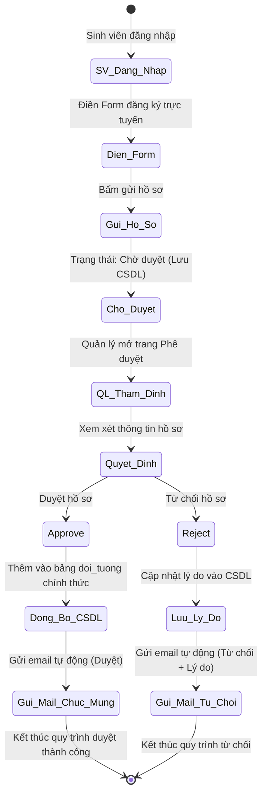
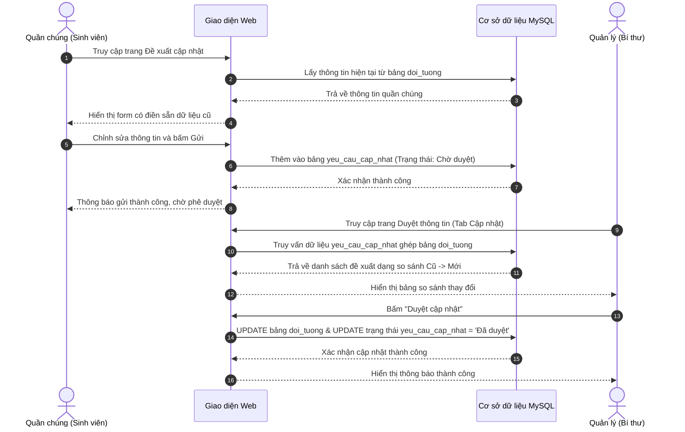
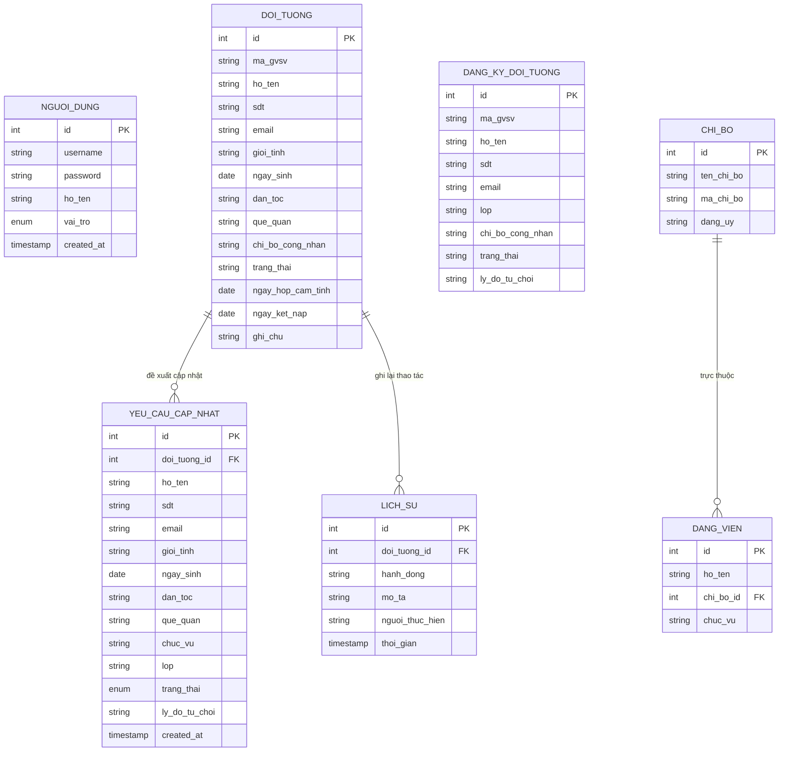

# BÁO CÁO BÀI TẬP LỚN: XÂY DỰNG WEBSITE QUẢN LÝ QUẦN CHÚNG ƯU TÚ PHỤC VỤ KẾT NẠP ĐẢNG

* **Môn học:** Thiết kế Website / Phát triển ứng dụng Web / Phân tích thiết kế hệ thống
* **Đề tài:** Thiết kế Website quản lý quần chúng ưu tú phục vụ kết nạp Đảng
* **Nhóm thực hiện:** [Điền tên nhóm của bạn vào đây]
* **Thành viên:**
  1. [Họ và tên SV 1] - [MSSV 1] - [Phân công công việc]
  2. [Họ và tên SV 2] - [MSSV 2] - [Phân công công việc]
  3. [Họ và tên SV 3] - [MSSV 3] - [Phân công công việc]

---

## I. GIỚI THIỆU ĐỀ TÀI

### 1. Lý do chọn đề tài
Công tác phát triển Đảng viên mới là một nhiệm vụ chính trị vô cùng quan trọng trong các tổ chức Đảng, đặc biệt là tại các trường Đại học nhằm bồi dưỡng thế hệ trẻ ưu tú. Tuy nhiên, quy trình quản lý thông tin từ giai đoạn quần chúng ưu tú, đi học lớp cảm tình Đảng, hoàn thành nhận thức, đến khi ra quyết định kết nạp và làm lễ kết nạp trải qua nhiều bước, nhiều thủ tục thủ công dễ gây thất lạc và chậm trễ thông tin. Vì vậy, việc thiết kế một Website chuyên nghiệp để số hóa quy trình quản lý, phê duyệt hồ sơ và theo dõi tiến trình kết nạp Đảng là hết sức thiết thực.

### 2. Mục tiêu đề tài
* **Số hóa quy trình:** Chuyển đổi toàn bộ quy trình nộp hồ sơ, duyệt và theo dõi tiến trình của quần chúng ưu tú sang môi trường trực tuyến.
* **Minh bạch thông tin:** Giúp sinh viên/quần chúng tự theo dõi được tiến trình của bản thân và xem danh sách bạn học cùng lớp đã được duyệt.
* **Tối ưu hóa quản trị:** Cung cấp cho Ban quản lý Chi bộ công cụ quản lý tập trung, sửa nhanh dữ liệu dạng Excel trực tiếp, import/export dữ liệu nhanh chóng và thống kê trực quan.

---

## II. PHÂN TÍCH VÀ THIẾT KẾ HỆ THỐNG (SYSTEM ANALYSIS & DESIGN)

### 1. Quy trình Nghiệp vụ (Business Workflows)

#### a. Quy trình Đăng ký & Phê duyệt Quần chúng mới
1. Sinh viên (chưa có tài khoản chính thức hoặc đăng ký qua tài khoản thường) đăng nhập hệ thống.
2. Sinh viên điền thông tin tự khai qua **Form đăng ký trực tuyến** (Họ tên và Mã SV tự động điền theo tài khoản đăng nhập để tránh giả mạo).
3. Hồ sơ được lưu ở trạng thái **Chờ duyệt** trong bảng `dang_ky_doi_tuong`.
4. Người quản lý (Bí thư) kiểm tra, đối chiếu thông tin:
   * Nếu **Đồng ý**: Bấm duyệt, hệ thống chuyển hồ sơ sang danh sách chính thức (`doi_tuong`), gửi Gmail chúc mừng tự động.
   * Nếu **Từ chối**: Nhập lý do từ chối, hệ thống gửi email phản hồi lý do chi tiết cho sinh viên chỉnh sửa lại.

#### b. Quy trình Đề xuất Cập nhật Thông tin
1. Quần chúng đã được duyệt chính thức đăng nhập vào hệ thống, truy cập trang **Cập nhật thông tin**.
2. Người dùng sửa đổi các thông tin cá nhân cần thiết (SĐT, Email, Quê quán, Lớp...) và gửi yêu cầu.
3. Yêu cầu được chuyển đến hàng đợi **Chờ duyệt cập nhật** (bảng `yeu_cau_cap_nhat`) của Quản lý.
4. Quản lý kiểm tra bảng so sánh sự thay đổi (Cũ ➔ Mới):
    * Nếu duyệt: Thông tin mới sẽ ghi đè trực tiếp vào bảng hồ sơ chính thức `doi_tuong`.
    * Nếu từ chối: Ghi nhận trạng thái từ chối cùng lý do phản hồi cho quần chúng.

#### c. Mô tả chi tiết cấu phần Giao diện & Chức năng

##### 👤 1. Giao diện Người dùng thường (Quần chúng / Sinh viên)
Giao diện được thiết kế tối giản, tập trung vào trải nghiệm cá nhân hóa, bao gồm các cấu phần chính sau:
* **Bản tin Dân trí đầu trang:** Khối hiển thị 4 bài báo mới nhất được lấy trực tiếp từ RSS Dân trí dưới dạng lưới thẻ Card. Giúp sinh viên nắm bắt thông tin thời sự nóng hổi ngay khi vừa đăng nhập.
* **Khối thông tin cá nhân (Profile Card):** Hiển thị thẻ thông tin chi tiết của quần chúng gồm ảnh đại diện chân dung, mã sinh viên, họ tên, ngày sinh, giới tính, số điện thoại, email, quê quán, dân tộc, lớp học và chi bộ theo dõi sinh hoạt.
* **Biểu đồ tiến trình (Timeline 5 bước):** Sơ đồ tuyến tính biểu diễn 5 cột mốc kết nạp Đảng của sinh viên:
  1. *Lớp cảm tình Đảng* ➔ 2. *Phân công giúp đỡ* ➔ 3. *Nhận thức về Đảng* ➔ 4. *Quyết định kết nạp* ➔ 5. *Đảng viên chính thức*.
  Mỗi cột mốc đi kèm thời gian hoàn thành cụ thể. Bước hiện tại của sinh viên sẽ được tô sáng màu vàng kim (`#FFD700`) nổi bật để người dùng dễ dàng theo dõi.
* **Bảng danh sách thành viên cùng Lớp:** Bảng thống kê toàn bộ các sinh viên trong cùng lớp học với tài khoản hiện tại đã được duyệt hồ sơ chính thức, giúp tăng cường tương tác và học hỏi giữa các quần chúng ưu tú.
* **Menu chức năng gửi đề xuất:** 
  * Nút *Gửi hồ sơ đăng ký mới* (dành cho tài khoản thường chưa có thông tin trong danh sách quần chúng).
  * Nút *Yêu cầu cập nhật thông tin* (mở ra form `cap_nhat_thong_tin.php` điền sẵn dữ liệu cũ, khóa Họ tên và Mã số SV để bảo mật, cho phép đề xuất gửi duyệt về Quản lý).

##### 💼 2. Giao diện Người quản lý (Bí thư Chi bộ / Quản trị viên)
Màn hình nghiệp vụ quản lý toàn quyền, cung cấp các công cụ xử lý dữ liệu quy mô lớn:
* **Bản tin Dân trí đầu trang:** Đồng bộ tin tức thời sự đầu trang chủ giống giao diện người dùng.
* **Khối chỉ số tổng quan (Dashboard Widgets):** 4 thẻ hiển thị các chỉ số đo lường nhanh số lượng hồ sơ hiện tại: *Tổng số quần chúng*, *Đang theo dõi*, *Đã kết nạp*, *Chờ duyệt đăng ký*.
* **Hệ thống thống kê đồ thị:** Tích hợp 2 biểu đồ cột và hình tròn của `Chart.js` để phân tích tỷ lệ trạng thái phát triển Đảng và phân bổ quần chúng ưu tú giữa các Chi bộ.
* **Bảng quản lý danh sách & Timeline:** Danh sách bộ lọc đa năng cho phép Bí thư tìm kiếm, sửa thông tin chi tiết, xóa hồ sơ và xem timeline chi tiết của từng người.
* **Bảng sửa nhanh trực tiếp dạng Excel:** Giao diện lưới ô tính tại `/Quan_ly_doi_tuong/sua_nhanh.php` cho phép Bí thư nhập liệu trực tiếp trên bảng và tự động lưu (Autosave qua AJAX) mà không phải load lại trang.
* **Hàng đợi Phê duyệt thông tin 2 cấp:** Giao diện phân loại theo tab thông minh:
  * *Tab Phê duyệt đăng ký mới:* Duyệt đơn đăng ký trực tuyến của sinh viên, đồng bộ vào danh sách chính thức và gửi email tự động chúc mừng; hoặc từ chối kèm nhập lý do từ chối gửi về hòm thư sinh viên.
  * *Tab Phê duyệt cập nhật:* Hiển thị bảng so sánh trực quan các thông tin thay đổi (Cũ ➔ Mới) của từng sinh viên. Bí thư có thể bấm "Duyệt" để ghi đè thông tin mới hoặc "Từ chối" và nhập lý do phản hồi.
* **Tiện ích Import/Export Excel:** Cho phép nhập danh sách quần chúng hàng loạt từ file Excel kéo thả và xuất báo cáo kết hợp backend Flask Python API chuyên nghiệp.

---

### 2. Biểu đồ Use Case (Use Case Diagram)

Dưới đây là sơ đồ các chức năng cốt lõi được phân quyền theo 3 tác nhân chính:

```mermaid
flowchart TD
    %% Tác nhân (Actors)
    User["👤 Người dùng thường (Sinh viên)"]
    Manager["💼 Quản lý (Bí thư)"]
    Admin["⚙️ Quản trị viên (Admin)"]

    %% Nhóm chức năng của Người dùng thường
    subgraph SG_User["Chức năng Sinh viên"]
        UC_Login["Đăng nhập / Đăng ký"]
        UC_Dash["Xem Dashboard cá nhân"]
        UC_Timeline["Xem tiến trình kết nạp 5 bước"]
        UC_Reg["Gửi yêu cầu đăng ký mới"]
        UC_Update["Gửi đề xuất cập nhật thông tin"]
        UC_Class["Xem danh sách bạn cùng Lớp"]
        UC_News["Xem tin tức Dân trí"]
    end

    %% Nhóm chức năng của Quản lý
    subgraph SG_Manager["Chức năng Quản lý (Bí thư)"]
        UC_List["Xem danh sách đối tượng chính thức"]
        UC_ExcelEdit["Sửa nhanh thông tin trực tiếp dạng Excel"]
        UC_ApproveReg["Phê duyệt hồ sơ đăng ký mới"]
        UC_ApproveUpdate["Phê duyệt đề xuất cập nhật"]
        UC_ExcelInOut["Nhập / Xuất dữ liệu Excel"]
        UC_Stats["Xem thống kê biểu đồ Chart.js"]
    end

    %% Nhóm chức năng của Admin
    subgraph SG_Admin["Chức năng Admin"]
        UC_Users["Quản lý tài khoản người dùng"]
        UC_Config["Cấu hình hệ thống chung"]
    end

    %% Mối liên kết giữa Actor và Use Case
    User --> UC_Login
    User --> UC_Dash
    User --> UC_Timeline
    User --> UC_Reg
    User --> UC_Update
    User --> UC_Class
    User --> UC_News

    Manager --> UC_Login
    Manager --> UC_List
    Manager --> UC_ExcelEdit
    Manager --> UC_ApproveReg
    Manager --> UC_ApproveUpdate
    Manager --> UC_ExcelInOut
    Manager --> UC_Stats
    Manager --> UC_News

    Admin --> UC_Users
    Admin --> UC_Config
    Admin --> SG_Manager
```

---

### 3. Biểu đồ Hoạt động (Activity Diagram - Phê duyệt đăng ký)

Quy trình xử lý một hồ sơ đăng ký từ phía sinh viên đến khi được quản lý duyệt:

---

### 4. Biểu đồ Tuần tự (Sequence Diagram - Đề xuất cập nhật)

Mô tả tương tác qua lại giữa Quần chúng, Hệ thống và Quản lý khi đề xuất cập nhật thông tin:

---

### 5. Phân quyền và Bảo mật (Security)
* **Bảo mật thư mục:** Sử dụng hàm kiểm tra quyền hạn `requireRole()` đặt ở đầu tất cả các file nghiệp vụ trong các thư mục `Quan_ly_doi_tuong/`, `Thong_ke_bao_cao/`, `He_thong/`.
* **Ràng buộc dữ liệu:** Khóa cứng Họ và tên, Mã sinh viên khi đăng ký hoặc cập nhật trực tuyến để tránh mạo danh tài khoản khác.
* **Chống tấn công injection:** Sử dụng câu lệnh chuẩn bị sẵn (Prepared Statements) của PDO để triệt tiêu lỗ hổng SQL Injection.

---

## III. THIẾT KẾ CƠ SỞ DỮ LIỆU (DATABASE DESIGN)

### 1. Sơ đồ Quan hệ Thực thể (ERD)

---

### 2. Đặc tả chi tiết các Bảng dữ liệu (Data Dictionary)

#### Bảng 1: `nguoi_dung` (Lưu tài khoản và vai trò phân quyền)
| Tên cột | Kiểu dữ liệu | Ràng buộc | Mô tả |
| :--- | :--- | :--- | :--- |
| `id` | INT | Primary Key, Auto Increment | Mã số tự tăng của tài khoản |
| `username` | VARCHAR(100) | Unique, Not Null | Tên đăng nhập (ví dụ: Mã sinh viên / Admin) |
| `password` | VARCHAR(255) | Not Null | Mật khẩu tài khoản (Băm bằng Bcrypt) |
| `ho_ten` | VARCHAR(255) | | Họ và tên đầy đủ của chủ tài khoản |
| `vai_tro` | ENUM | Default 'Người dùng thường' | Gồm: 'Người dùng thường', 'Quản lý', 'Admin' |
| `created_at` | TIMESTAMP | Current Timestamp | Thời gian khởi tạo tài khoản |

#### Bảng 2: `doi_tuong` (Danh sách hồ sơ quần chúng chính thức)
| Tên cột | Kiểu dữ liệu | Ràng buộc | Mô tả |
| :--- | :--- | :--- | :--- |
| `id` | INT | Primary Key, Auto Increment | Mã định danh đối tượng |
| `ma_gvsv` | VARCHAR(50) | | Mã số SV hoặc GV |
| `ho_ten` | VARCHAR(255) | Not Null | Họ và tên đầy đủ |
| `lop` | VARCHAR(100) | | Lớp hành chính học tập |
| `sdt` | VARCHAR(20) | | Số điện thoại liên hệ |
| `email` | VARCHAR(255) | | Địa chỉ Email |
| `gioi_tinh` | VARCHAR(10) | | Giới tính (Nam / Nữ) |
| `ngay_sinh` | DATE | | Ngày sinh |
| `dan_toc` | VARCHAR(50) | | Dân tộc |
| `que_quan` | TEXT | | Địa chỉ quê quán |
| `chi_bo_cong_nhan`| VARCHAR(255) | | Chi bộ theo dõi hoặc công nhận |
| `trang_thai` | VARCHAR(50) | Default 'Đang theo dõi'| Gồm: 'Đang theo dõi', 'Đã kết nạp', 'Đã chuyển' |

#### Bảng 3: `dang_ky_doi_tuong` (Đơn đăng ký trực tuyến chờ duyệt)
| Tên cột | Kiểu dữ liệu | Ràng buộc | Mô tả |
| :--- | :--- | :--- | :--- |
| `id` | INT | Primary Key, Auto Increment | Mã số tự tăng |
| `ma_gvsv` | VARCHAR(50) | Not Null | Mã số SV |
| `ho_ten` | VARCHAR(255) | Not Null | Họ và tên sinh viên tự khai |
| `sdt` | VARCHAR(20) | | Số điện thoại |
| `email` | VARCHAR(255) | Not Null | Email để nhận thông báo duyệt |
| `lop` | VARCHAR(100) | Not Null | Lớp sinh hoạt |
| `trang_thai` | VARCHAR(50) | Default 'Chờ duyệt' | Gồm: 'Chờ duyệt', 'Đã duyệt', 'Đã từ chối' |
| `ly_do_tu_choi` | TEXT | | Lý do Quản lý từ chối (nếu có) |

#### Bảng 4: `yeu_cau_cap_nhat` (Đơn đề xuất chỉnh sửa thông tin)
| Tên cột | Kiểu dữ liệu | Ràng buộc | Mô tả |
| :--- | :--- | :--- | :--- |
| `id` | INT | Primary Key, Auto Increment | Mã số tự tăng |
| `doi_tuong_id` | INT | Foreign Key (doi_tuong), Not Null | Liên kết tới bảng đối tượng chính thức |
| `sdt` | VARCHAR(20) | Not Null | Số điện thoại mới đề xuất |
| `email` | VARCHAR(255) | Not Null | Email mới đề xuất |
| `lop` | VARCHAR(100) | Not Null | Lớp mới đề xuất |
| `que_quan` | TEXT | | Quê quán mới đề xuất |
| `chuc_vu` | VARCHAR(100) | | Chức vụ mới |
| `trang_thai` | ENUM | Default 'Chờ duyệt' | Gồm: 'Chờ duyệt', 'Đã duyệt', 'Đã từ chối' |
| `ly_do_tu_choi` | TEXT | | Lý do Quản lý bác bỏ cập nhật |

---

## IV. CHI TIẾT CÔNG NGHỆ & CẤU TRÚC TRIỂN KHAI

### 1. Kiến trúc phân tách theo thư mục phân tích hệ thống (Vietnamese Structure)
* **`Cau_hinh/`**: Đảm nhiệm cài đặt hệ thống và cơ sở dữ liệu (`db.sql`, `setup.php`).
* **`Giao_dien/`**: Giao diện UI/UX tối ưu Dark Mode và Responsive (`header.php`, `footer.php`, CSS, hình ảnh).
* **`Quan_ly_doi_tuong/`**: Nghiệp vụ quản lý chính đối với quần chúng ưu tú, duyệt đơn đăng ký (`duyet_dang_ky.php`), đề xuất cập nhật thông tin cá nhân (`cap_nhat_thong_tin.php`), xem thành viên cùng lớp/chi bộ (`thanh_vien_chi_bo.php`) và đơn đăng ký trực tuyến (`nhap_thong_tin.php`).
* **`Quan_ly_danh_muc/`**: Danh mục phân quyền chi bộ và đảng viên hỗ trợ.
* **`Thong_ke_bao_cao/`**: Biểu đồ phân tích và công cụ xuất nhập dữ liệu file Excel.
* **`He_thong/`**: Cấu hình cấu trúc trường học và thay đổi mật khẩu hệ thống.
* **`User/`**: Bảo mật đăng nhập, đăng ký tài khoản, kiểm tra phiên làm việc (session cookie) và xác thực quyền hạn.

### 2. Công nghệ sử dụng
* **Frontend**: HTML5, Vanilla CSS3 (Hệ màu Dark mode phối hợp Đỏ-Vàng sang trọng, Responsive linh hoạt), JavaScript ES6 (AJAX Fetch API).
* **Backend**: PHP 8.x thuần kết nối CSDL qua PDO bảo mật chống SQL Injection.
* **Tích hợp RSS/XML Parser**: Sử dụng `simplexml_load_string` và cơ chế luồng `stream_context_create` có thiết lập timeout của PHP để nạp tin tức trực tuyến đa nguồn (Dân trí, Báo Nhân Dân, Báo điện tử Đảng Cộng sản) đồng thời tích hợp logic dự phòng thông tin linh hoạt.
* **Python API (Flask)**: Phục vụ xuất báo cáo định dạng cao cấp qua các thư viện xử lý bảng tính chuyên dụng.
* **Cơ sở dữ liệu**: MySQL (hệ quản trị cơ sở dữ liệu XAMPP).

---

## V. KẾT LUẬN & HƯỚNG PHÁT TRIỂN

* **Ưu điểm**:
  * Giao diện phối màu cờ Đảng trang nghiêm, hiện đại, bắt mắt.
  * Tích hợp bản tin thời sự đa nguồn chính thống (Dân trí, Nhân Dân, Đảng Cộng sản) thời gian thực ở đầu Dashboard giúp cập nhật tin tức nhanh chóng và phù hợp chuyên môn công tác Đảng.
  * Phân quyền chặt chẽ 3 cấp tài khoản bảo mật.
  * Tính năng cập nhật thông tin đề xuất và duyệt cập nhật trực quan so sánh thay đổi Cũ ➔ Mới giúp công tác quản lý của Bí thư cực kỳ tiện lợi.
  * Sinh viên dễ dàng xem được thông tin của bạn học cùng lớp học của mình khi được duyệt.
* **Hạn chế**: Cần cấu hình môi trường Python để chạy song song server API xuất Excel/PDF.
* **Hướng phát triển**: Tích hợp gửi mail qua SMTP Google thực tế; Xây dựng bản ứng dụng mobile hỗ trợ quản lý di động.
